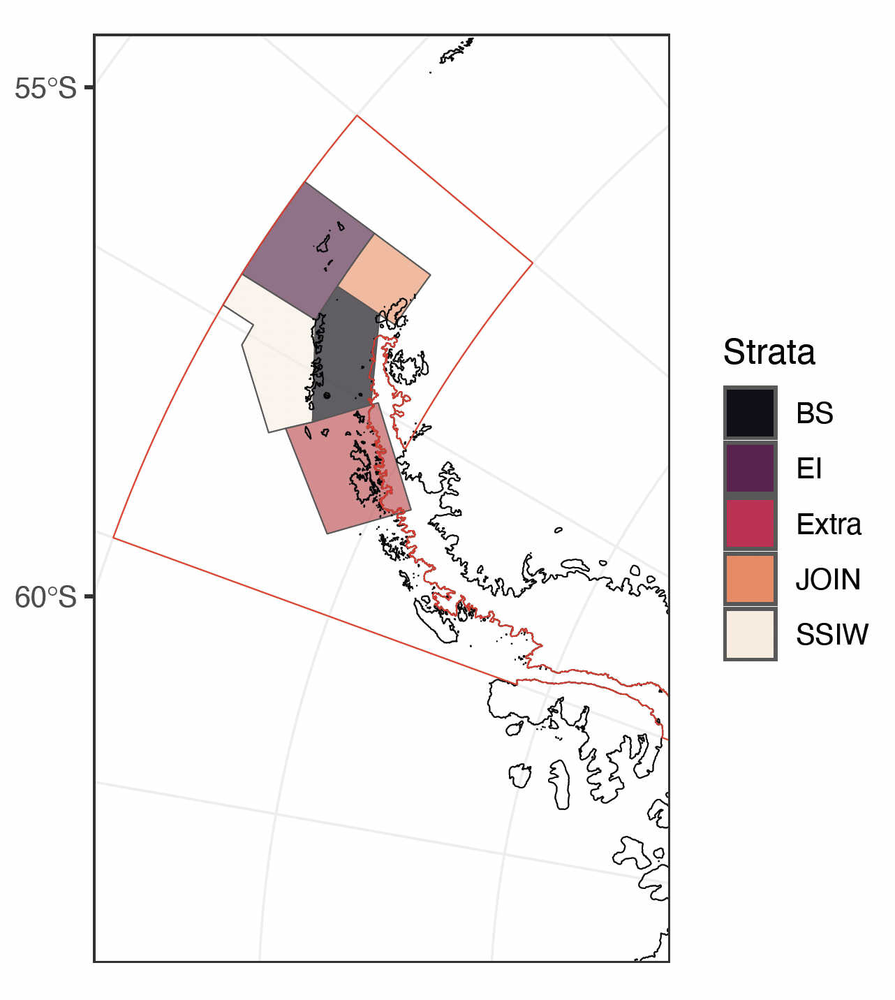
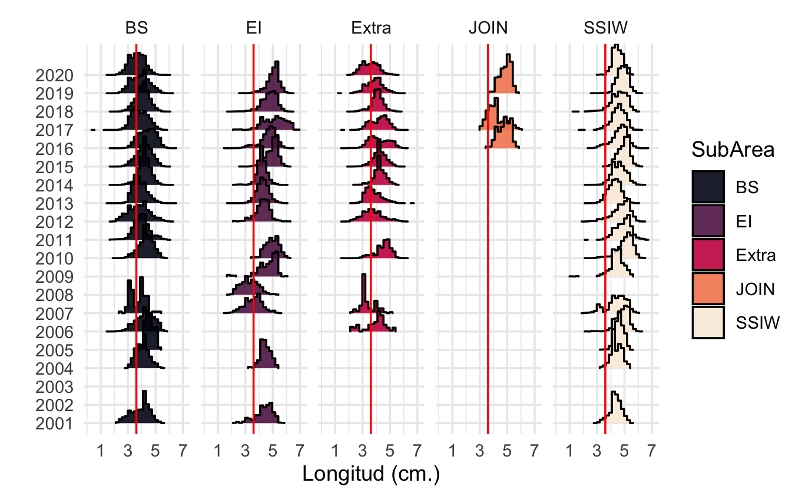

```{r setup1, echo=FALSE}
rm(list = ls())
knitr::opts_chunk$set(message = FALSE,
                      warning = FALSE,
                      fig.align = 'center',
                      fig.pos = "H",
                      dev = 'jpeg',
                      dpi = 300)
#XQuartz is a mess, put this in your onload to default to cairo instead
options(bitmapType = "cairo") 
# (https://github.com/tidyverse/ggplot2/issues/2655)
# Lo mapas se hacen mas rapido
```

```{r message=FALSE}
## Installing the Package
#The LBSPR package is now available on CRAN:
#install.packages("LBSPR")
#install.packages("devtools")
#devtools::install_github("AdrianHordyk/LBSPR")
###load the package
library(LBSPR)
library(devtools)#to install_github
library(dplyr)
library(tidyr)
library(ggplot2)
library(stringr)
library(ggpubr)
library(kableExtra)
library(hrbrthemes)
library(ggthemes)
library(tidyverse)
```

```{r}
My_theme <- theme(axis.text.y = element_blank(),
                  axis.ticks.y = element_blank(),
                  axis.ticks.x=element_blank(),
                  panel.background = element_blank(),
                  panel.border = element_rect(fill = NA, size = 1),
                  strip.background = element_rect(fill = "white", 
                                                  color = "white", 
                                                  size = 1),
                  text = element_text(size = 14),
                  panel.grid.major = element_line(colour = "white", 
                                                  size = 0.1),
                  panel.grid.minor = element_line(colour = "white", 
                                                  size = 0.1))
```

# ABSTRACT

One approach for understanding the dynamics of krill populations in the Antarctic Peninsula is through the analysis of empirical data, such as size composition obtained from fishery monitoring. By studying this data over multiple years and considering life history parameters, we can assess the intrinsic productivity of krill and potential changes over time and in different areas. To achieve this, we have employed the Length-Based Spawning Potential Ratio (LBSPR) method. This method allows us to estimate the reproductive potential of the population based on current exploitation levels, as well as its comparison to a virgin condition. By identifying reference points specifically related to reproductive potential, the LBSPR method provides insights about the state of the krill population. Recognizing spatial and temporal changes in the intrinsic productivity of krill, as indicated by their reproductive potential, is crucial for the understanding of the unique characteristics of this species. Moreover, these findings have important implications for management strategies within the context of the Commission for the Conservation of Antarctic Marine Living Resources (CCAMLR). By integrating knowledge of krill dynamics and its reproductive potential, advise can be produced to ensure the sustainable management of krill populations in subarea 48.1.

*Keywords: Krill populations, dynamic population, size compositions, Spawning Potential Ratio (SPR), Management, CCAMLR.*

\newpage

# INTRODUCTION

The western Antarctic Peninsula ecosystem is a critical region of the Southern Ocean for populations of Antarctic krill (*Euphausia superba*; hereafter krill) serving as a major spawning and recruitment area and as an overwintering hotspot, especially within Bransfield Strait. Over the last 40 years, climate driven changes have resulted in warming waters, declines in seasonal sea ice extent and duration [@Stammerjohn2008a; @Stammerjohn2008], changing trends phytoplankton productivity [@Saba2014; @Siegel2013].

Additionally, changes have impacted the population dynamics of krill, resulting in distribution changes with consequent contraction of the population in the southwest Atlantic Ocean toward the peninsula [@Atkinson2009]. In addition, changes in the population structure have also verified in krill in recent years [@Reiss2020]. The mentioned temporal and spatial changes have implications for the reproductive potential of the species and this, therefore, for intrinsic productivity.

One way to understand and measure changes in intrinsic productivity is through assessing the ratio of krill reproductive potential. There are many length-based assessment methods to understand this changes between years [@Rudd2017a; @Froese2018; @Hordyk2016; @Canales2021]. On the other hand, one of the advantages of these methods is to use one of the most reliable and abundant sources in the sampling of fishing activities, such as size structures [@Canales2021].

Spatial and temporal changes in the population structure have been a relevant issue within CCAMLR (Commission for the Conservation of Antarctic Marine Living Resources) fisheries management schemes. In this sense, new more localized or reduced spatial scales have been proposed to identify changes in these scales. Despite these proposals to identify krill population dynamics at a finer level, these schemes are not yet operational for decision making [@Hill2016; @McBride2021].

We then propose to identify differences in krill reproductive potential at the finer spatial and temporal scales, propose a specific reference point considering the spatial scale, and ultimately provide recommendations for sustainable management of the krill fishery through intrinsic productivity in Subarea 48.1 on the Antarctic Peninsula in the Southern Ocean.

\newpage

# METHODOLOGY

## Study area

The study area includes subarea 48.1, which is one of the sectors where today the largest amount of krill fishing is concentrated [@McBride2021; @Atkinson2022; @SantaCruz2022]. In order to have a finest spatial definition of krill dynamics population, we will analyze the differences between the management strata defined in WG-EMM-2021/05 Rev. (@Dornam2021), namely Brainsfield Strait, Elephant Island, Extra, Joinville Island and South West (hereafter BS, EI, Extra, JOIN and SSIW respectively) (Figure \@ref(fig:Figure1)).

```{r Figure1, echo=FALSE, out.width='60%', fig.cap= "Subarea 48.1 and management strata considered in the spatio-temporal analysis of intrinsic productivity of Krill (BS=Brainsfield Strait, EI= Elephant Island, Extra= Extra, JOIN= Joinville Island, SSWI= South West)"}

```

## Monitoring Data (SISO Program)

For this analysis, data from the monitoring of the krill fishery were used, which have been systematically collected on board fishing vessels by the CCAMLR SISO (Scheme of International Scientific Observation) program. Krill sizes compositions were obtained from the entire area 48.1, which was combined in each management stratum defined at 2.1 section (Figure \@ref(fig:Figure2)).

```{r Figure2, echo=FALSE, out.width='100%', fig.cap="\\label{Figure 2}Sizes compositions from SISO program monitoring krill fishery by strata (BS=Brainsfield Strait, EI= Elephant Island, Extra= Extra, JOIN= Joinville Island, SSWI= South West). Red line represent recruit size"}

```

The information gaps (years without sizes composition data) are not calculated because there is no autocorrelation between years, but singular estimators over time.

## Biological and fishery parameters krill

```{r}
#Create a new LB_pars Object
#To create a new LB_pars object you use the new function:
MyPars <- new("LB_pars")

#You can see the elements or slots of the LB_pars object using the
#slotNames function:
#slotNames(MyPars)
```

The model needs specifications related to both biological and fishery parameters according to species evaluated. In a descriptive way, the main parameter sets are described as follows;

**Biology**

-   von Bertalanffy asymptotic length `Linf`
-   M/K ratio (natural mortality)divided by von Bertalanffy K coefficient) `MK`
-   Length at 50% maturity (`L50`)
-   Length at 95% maturity (`L95`)

**Fishery**

-   Length at 50% selectivity (`SL50`)
-   Length at 95% selectivity (`SL95`)
-   Biological Reference Point (BRP). F/M ratio (`FM`) or Spawning Potential Ratio (`SPR`). If you specify both, the F/M value will be ignored.

**Size Classes**

-Width of the length classes (`BinWidth`)

```{r}
MyPars <- new("LB_pars")
## A blank LB_pars object created
## Default values have been set for some parameters
MyPars@Species <- "Euphausia superba"
MyPars@Linf <- 60 
MyPars@L50 <- 34 
MyPars@L95 <- 55 # verrificar bibliografia
MyPars@MK <- 0.4/0.45


#Explotation
MyPars@SL50 <- 40#numeric() #1
MyPars@SL95 <- 56#numeric() #27
MyPars@SPR <- 0.75 #numeric()# ###cambia el numero 0.4 a en blanco
MyPars@BinWidth <- 1
#MyPars@FM <- 1

MyPars@Walpha <- 1
MyPars@Wbeta <- 3.0637 #r2 = 0.9651

MyPars@BinWidth <-1
MyPars@BinMax <- 70
MyPars@BinMin <- 0
MyPars@L_units <- "mm"
```

These parameters were taken from previous works about krill life history and fishery [@Thanassekos2014; @Maschette2020], which are described (Table \@ref(tab:Table1).

```{r table_par}
tablepar <-data.frame(Value=c(MyPars@Linf,
                       MyPars@L50 ,
                       MyPars@L95 ,
                       round(MyPars@MK,3) ,
                       MyPars@SL50 ,
                       MyPars@SL95 ,
                       MyPars@SPR ,
                       MyPars@Walpha ,
                       MyPars@Wbeta ,
                       MyPars@BinMax,
                       MyPars@BinMin ,
                       MyPars@L_units),
                      Descrption=c("VB asymptotic length",
                                   "Maturity 50%",
                                   "Maturity 95%",
                                   "M/K Ratio",
                                   "Selectivity 50%",
                                   "Seletivity 95%",
                                   "SPR",
                                   "a (Length-Weight Relation)",
                                   "b (Length-Weight Relation)",
                                   "Bin Min",
                                   "Bin Max",
                                   "Units"))
```


```{r Table1}
kbl(tablepar, 
    longtable = F, 
    booktabs = T, 
    caption = "\\label{Table1}Krill biological and fishery parameters") %>% 
   kable_styling(latex_options = c("striped", 
                                   "hold_position"),
                 html_font = "arial")
```

## Assessment of intrinsic productivity

The intrinsic productivity of krill was evaluated through a method that measures the reproductive potential of commercially exploited marine species known as LBSPR (Length Based Spawining Potential Ratio) and described by @Hordyk2016. The LBSPR method has been developed for data-limited fisheries, where few data are available other than a representative sample of the size structure of the vulnerable portion of the population (i.e., the catch) and an understanding of the life history of the species. The Length-Based Spawning Potential Ratio (LBSPR) method assumes the reproductive characteristics of the species based on the life history parameters, being able to establish management strategies for long-lived species with low reproductive output as well as highly reproductive species with a high growth constant such as krill [@Prince2018].

LBSPR uses length-composition data and assumptions about biological parameters to make a rapid assessment of stock status relative to unfished levels assuming equilibrium conditions. While LBSPR can use multiple years of length data, status determination is based on one year of data at a time (i.e., estimates of status over multiple years are based on that year's length composition alone). Mean-length mortality estimators, first developed by @Beverton1957, assume that fishing mortality directly influences mean length of the catch and therefore in the reproductive potential of the species. Al l this concept about life history and implications in spawning potential ratio was revisited by @Jensen1996.

## Model Estimation LBSPR

Recent work has shown that under equilibrium conditions (that is, constant F and no recruitment variability) and assuming the von Bertalanffy growth equation, constant natural mortality for all ages, and logistic or jack-knife selectivity, standardization of the composition of lengths of two populations with the same ratio of natural mortality to growth rate (*M/k*) and the same ratio of mortality by fishing to natural mortality (*F/M*) will be identical [@Hordyk2016]. Extension of this model to incorporate length-at-age variability and logistic selectivity confirms that, at equilibrium, the composition of the predicted duration of catch of an exploited population is primarily determined by the ratios of M/k and F/M. The analytical models developed in @Hordyk2014c suggest that with knowledge of the asymptotic von Bertalanffy length $L_{\infty}$ and the coefficient of variation in $CVL_{\infty}$, the ratio of total mortality to the von Bertalanffy growth coefficient (*Z/k*) for a given population can be estimated from a representative sample of the size structure of the catch. If *M/k* (or parameters) is also known, then the results of @Hordyk2016 suggest that it is possible to estimate F/M from the composition of the catch. Often the F/M ratio has been used as a biological reference point when is 1 [@Zhou2012].

The LBSPR model requires the following parameters: an estimate of the M/k ratio, $L_{\infty}$, $CVL_{\infty}$, and knowledge of maturity by length (maturity ogive), both set parameters know in krill. This model uses data on composition by catch sizes to estimate intrinsic productivity or Spawning Potential Ratio (SPR). This concept was extracted from @Goodyear1993, where the ratio of lifetime average egg production per recruit (EPR) was calculated for fish and non-fish resources. An algorithm route for the calculation of the SPR is the following;

$${SPR}=\frac{EPR_{fished}}{EPR_{nofished}}$$ where;

$$
EPR_{fished} =
\sum_{a}
\begin{cases}
 E_{a},  a = 0  \\
 e^{-Z_{{a-1}}a} {E_a}, 0 < a  < a_\le{max}
 \end{cases}       
$$ where $Z_a$ = $M+F_a$, and $E$ is egg production at age assumed to be proportional to weight;

$$E_a \in  Mat_a W_a$$ on the other hand, the calculation of the reproductive potential is the same as that of those captured without F; $$
EPR_{nofished} =
\sum_{a}
 E_ae^{-M_a}
$$ Assuming that egg production is proportional to the size of mature fish, relative fecundity-at-size is given by;

$$
Fec_{L,g} = Mat_{L,g} L^b
$$ where b is value of the exponent to reflect differente size fecunditity relationship and g is the fraction of recruits to group.

Assuming reasonable estimates of the M/K ratio, $L_{\infty}$ (or $CVL_{\infty}$), size-at-maturity, the parameters F/M, $SL_{50}$, and $SL_{95}$ can be estimated from a representative sample of the length structure of the catch by minimizing the following multinomial negative loglikelihood function (NLL):

$$
NLL =
argmin\sum_{i}
 O_i ln\frac{\hat{P}_i}{\hat{O}_i}
$$

where $O_i$ and $\hat{O}_i$ are the observed number and proportion in length class i, respectively, and $\hat{P}_i$ is the model estimate of the probability in length class i [@Hordyk2016].

Like any assessment method, the LBSPR model relies on a number of simplifying assumptions. In particular, the LBSPR models are both equilibrium based and that the length composition data is representative of the exploited population at steady state [@Hordyk2014c; @Hordyk2016]. This methodology was implemented through the package [@Hordyk2014c] and this code and data could be visited in [LBSPRKrill](https://github.com/MauroMardones/LBSPR_Krill).

## Biological References Point (PBR) in krill.


A constant challenge for krill has been to provide indicators of stock status that can be compared to predetermined biological reference points. The intrinsic productivity or SPR is commonly used to set the limit and target reference point [@Goodyear1993; @Mace2001; @Prince2014]. By definition, the SPR is equal to 100% in an unexploited stock, and zero in a non-spawning stock (eg all mature fish have been removed, or all females have been caught). The F40%, that is, the fishing mortality that allows an escape of 40% of the biomass to MSY, is the fishing mortality rate that translates into SPR = 40%, is considered a reference point to many species [@Clark2002]. Suitable SPR biological points can be derived from hypotheses about the steepness of the stock-recruit relationship [@Brooks2013; @Hordyk2016].

However @Prince2014 provide some considerations in relation to the life strategy of the organisms and the SPR necessary to ensure the sustainability of the fishery. In this work, three types (I, II and III) are identified, which refers to the r and K life strategy. The krill is Type 1 (r-strategy), M/k=\~1 (m=0.4, k =0.43) therefore, it requires a higher save of SPR.

On the other hand, the current krill fisheries management schemes established by @CCAMLR2010, @Constable2000 proposes a decision rule scheme based on biomass that ensure the sustainability of this resource in the Southern Ocean. Through a simulation process, a 20-year projection of the krill population is generated, and a probability distribution is established around two decision rules. The first rule is based on the lowest level of exploitation allowed, around 20% of biomass, which could be consider a limit reference point. The second is the target level of the fishery, which indicates the statistical distribution of the biomass at the end of the 20-year projection under a constant catch that allows the average escape of 75% at pre-exploited levels (CCAMLR-2000 Survey). Linking this management scheme to intrinsic productivity of krill, we used two reference points for intrinsic krill productivity, 20% SPR as the limit reference point and 75% as the target to this fishery.

With this references points we can test a challenge for fishing exploitation and sustainability of krill in the Antarctic Peninsula, which is related to overfishing by recruitment. This condition occurs when the adult (reproductive) fraction has been severely reduced due to excessive fishing, jeopardizing the success of recruitment and stock replenishment in order to ensure sustainability [@Cubillos2005; @HilbornWalters92] in relation to the previously mentioned PBRs.

The LBSPR package can be used to generate the expected size composition, the SPR, and relative yield for a given set of biological and exploitation pattern parameters. The output of the `LBSPRsim` function is an object of class `LB_obj`. This is another LBSPR object, and contains all of the information from the `LB_pars` object and the output of the `LBSPRsim` function.

It is important to note that the F/M ratio reported in the LBSPR model refers to the apical F over the adult natural mortality rate. That is, the value for fishing mortality refers to the highest level of F experienced by any single size class [@Hordyk2014c]. If the selectivity pattern excludes all but the largest individuals from being exploited, it is possible to have a very high F/M ratio in a sustainable fishery (high SPR) and visceverse. Note that only the life history parameters need to be specified for the estimation model. The exploitation parameters will be estimated [@Hordyk2014c].

```{r, message=FALSE, eval=FALSE}

## Plotting the Simulation

MySim <- LBSPRsim(MyPars, 
                  Control=list(modtype="GTG"))

# Plot with
plotSim(MySim, type="len.freq",
        Cols = NULL, 
        size.axtex = 12, 
        size.title = 14,
        size.SPR = 4,
        size.leg = 12,
        inc.pts = TRUE, 
        size.pt = 6)
```

Two objects are required to fit the LBSPR model to length data: life-history parameters (`LB_pars`) described previously (2.4. section) and size compositions (`LB_lengths`), which contains the length frequency data. We provide a set of global size data and also by strata, with which we will be able to identify the spatial differences of the potential.

```{r eval=FALSE}
MyLengths <- new("LB_lengths")
slotNames(MyLengths)
```

However, it is probably easier to create the `LB_lengths` object by directly reading in a `.csv`. A length frequency data of krill set with multiple years (2001-2020) by strata in 48.1 Subarea.

```{r message=F}
#Brainsflied Strata
datdir <- setwd("~/DOCAS/LBSPR_Krill")
Lenbs <- new("LB_lengths", LB_pars=MyPars, file=paste0(datdir, "/Length_481_Krill_2.csv"), dataType="freq",sep=";",header=T)
#Elephan Island Strata
Lenei <- new("LB_lengths", LB_pars=MyPars, file=paste0(datdir, "/lenghtEI.csv"), dataType="freq",sep=";",header=T)
#Extra Strata
Lenex <- new("LB_lengths", LB_pars=MyPars, file=paste0(datdir, "/lenghtExtra.csv"), dataType="freq",sep=";",header=T)
#Join Strata
Lenjo <- new("LB_lengths", LB_pars=MyPars, file=paste0(datdir, "/lenghtJOIN.csv"), dataType="freq",sep=";",header=T)
#SSIW Strata
Lenssiw <- new("LB_lengths", LB_pars=MyPars, file=paste0(datdir, "/lenghtSSIW.csv"), dataType="freq",sep=";",header=T)
```

```{r message=FALSE}

## 2.9. Fit the Model by strata

# The LBSPR model is fitted by strata using the `LBSPRfit` function. 
fitbs <- LBSPRfit(MyPars, Lenbs)
fitei <- LBSPRfit(MyPars, Lenei)
fitex <- LBSPRfit(MyPars, Lenex)
fitjo <- LBSPRfit(MyPars, Lenjo)
fitssiw <- LBSPRfit(MyPars, Lenssiw)
```

## Sensitivity and perfomance analysis.

Ten sensitivity scenarios based on the upper and lower range for the asymptotic length von Bertalanffy $L_{\infty}$ (55 to 65 mm) used in the base model (60 mm) were tested to identify the impact of this parameter on the SPR estimation, given that it is the parameters exhibiting the high degree of variability and one of the factors that most determines the estimates. On the other hand, the interdependence between krill and their environment is a well-known and influential factor in population dynamics, ecosystem impacts, and fishery. This interdependence also affects the reproductive potential and consequently, to any management decision that takes into account population parameters of krill. To assess the impact of individual growth variability, three scenarios of the VB k parameter were tested, representing different growth types (low = 0.2, medium = 0.7, and high = 1.2). Figure \@ref(fig:Figure3) displays a theoretical growth curve for krill based on three scenarios that were tested using LBSPR.

```{r Figure3, out.width="70%", fig.cap="Theoretical growth scenarios to krill varability"}
# Definir los parámetros del modelo de Von Bertalanffy
L_inf <- 60
k <- c(0.2, 0.7, 1.2)
t_0 <- 0
# Crear un vector de edades
edades <- seq(0, 8, by = 0.2)
# Calcular los valores teóricos de crecimiento somático
df <- data.frame(edades = rep(edades, 
                              length(k)), 
                 k = rep(k, each = length(edades)))

df <- df %>% 
  mutate(crecimiento = L_inf * (1 - exp(-k * (edades - t_0))))
# Graficar la curva de crecimiento somático
sen <- ggplot(df, aes(x = edades, 
               y = crecimiento, 
               color = factor(k))) +
  geom_line(size=1.5) +
  xlab("Ages") +
  ylab("Length (mm)") +
  ggtitle("") +
  theme(panel.background = element_rect(),
        panel.grid.major = element_blank(),
        panel.grid.minor = element_blank())+
  scale_color_viridis_d(option="C",
                       name = "Theoretical growth",
                       labels = c("Low", "Medium", "High"))+
  theme_few()
sen
```

After applying each scenario using each of the parameter setting, the results of scenarios are compared with the results provided by the methods based setting (Table 1), analyzing in this way the efect of underestimation/overestimation of the parameters $L_{\infty}$ and *k*.


# RESULTS

## Model Perfomance

The results demonstrate good fits of the size structure distribution model for krill across the strata. The model accurately captures the distribution patterns of size classes, indicating its effectiveness in characterizing the population structure. The model successfully captures the variations in size distribution, reflecting the natural variability in krill populations across different strata. These findings suggest that the model can be utilized as a valuable tool for understanding and predicting size structure dynamics in krill populations (Figure \@ref(fig:Figure4)).

```{r Figure4, fig.cap="Fit of the model to the data of lengths in Braishfield strata", out.width="80%"}
plotSize(fitei,
         Title="Braisnfield strata")+
  My_theme
```

The Joinville strata exhibits the least model fits, supposedly attributed to the limited available size compositions data spanning only three years (Figure \@ref(fig:Figure5)).

```{r Figure5, fig.cap="\\label{Figure5}Fit of the model to the data of lengths in Joinville strata", out.width="60%"}
plotSize(fitjo,
         Title="Joinville strata")+
  My_theme
```

For all the other strata (Extra, EI and SSWI) the model predict sizes compositions in a correct way for all the years (for details see [LBSPRKrill](https://github.com/MauroMardones/LBSPR_Krill)).

```{r eval=FALSE}
plotSize(fitei,
         Title="Elephan Island strata")
plotSize(fitex,
         Title="Extra strata")
plotSize(fitjo,
         Title="Joinville strata")
plotSize(fitssiw,
         Title="SSWI strata")
```

The difference between the observed accumulated size compositions for each stratum and compare it with the expected size composition at a target SPR (75% SPR). In the simulation of the structure in its virgin condition (without fishing), the red bars represent each stratum. Additionally, the overlap with the average structures observed during the years of fishery monitoring can be visualized. The SSWI Extra and EI strata exhibit the greatest differences from the simulated structure, possibly due to the significant contribution of juveniles in these strata. Conversely, the BS and JO strata demonstrate the closest resemblance to the simulated structure (Figure \@ref(fig:Figure6)).

```{r Figure6, fig.cap="Difference between the observed accumulated size structure for each stratum related SPR objective", out.width="80%"}
yr <- 5 # first year of data

bscom <- plotTarg(MyPars, Lenbs, yr=yr,
                  Cols = c(2,4),
                  size.axtex = 8,
                  title="BS",
                  targtext = FALSE)+
  My_theme 
eicom <- plotTarg(MyPars, Lenei, yr=yr,
                  Cols = c(2,4),
                  size.axtex = 8,
                  title="EI",
                  targtext = FALSE)+
  My_theme 
excom <- plotTarg(MyPars, Lenex, yr=yr,
                  Cols = c(2,4),
                  size.axtex = 8,
                  title="Extra",
                  targtext = FALSE)+
  My_theme 
jocom <- plotTarg(MyPars, Lenjo, yr=1,
                  Cols = c(2,4),
                  size.axtex = 8,
                  title="JOIN",
                  targtext = FALSE)+
  My_theme 
sscom <- plotTarg(MyPars, Lenssiw , yr=yr,
                  Cols = c(2,4),
                  size.axtex = 8,
                  title="SSWI",
                  targtext = FALSE)+
  My_theme 

ggarrange(bscom, eicom + rremove("ylab"), 
          excom + rremove("ylab"),
          jocom, sscom + rremove("ylab"), 
          ncol = 3, nrow = 2,
          legend="bottom",
          common.legend = TRUE)
```

Furthermore, ogive maturity curve specific to each stratum and year, as well as the estimated length selectivity curve, are presented in Figure \@ref(fig:curve_mat). These curves offer crucial insights into the fishery's impact on the population and its reproductive status, providing measures of the population's vulnerability to fishing mortality. Notably, the Braisnfield stratum stands out with a lower proportion of mature individuals, suggesting a higher prevalence of juveniles. It is important to note that the same maturity parameters were applied across all strata.

```{r curve_mat, echo=FALSE, fig.cap= "Maturity curves by strata", out.width="80%"}

bsmat <- plotMat(fitbs,
        useSmooth = TRUE,
        Title="BS")+
  My_theme 
eimat <-  plotMat(fitei,
        useSmooth = TRUE,
        Title="EI")+
  My_theme 
exmat <-  plotMat(fitex,
        useSmooth = TRUE,
        Title="Extra")+
  My_theme 
jomat <-  plotMat(fitjo,
        useSmooth = TRUE,
        Title="JOIN")+
  My_theme 
ssmat <-  plotMat(fitssiw,
        useSmooth = TRUE,
        Title="SSWI")+
  My_theme 

ggarrange(bsmat,
          eimat + rremove("ylab"), 
          exmat , 
          jomat + rremove("ylab"), 
          ssmat, 
          ncol = 2, nrow = 3,
          legend="right",
          common.legend = TRUE)
```

```{r, eval=FALSE, echo=FALSE}
plotEsts(fitbs,
         pars = c("FM", "SPR"),
  doSmooth = TRUE,
  incL50 = FALSE,
  CIcol = "blue",
  L50col = "blue")
```

## Comparing producivity between years and Stratas

The analysis of the krill population's reproductive potential across different years and strata reveals significant differences. Brainsfield and Extra strata exhibit a low reproductive potential below the proposed management target of 75% in the last year, with values of 0.121 and 0.085, respectively, falling even below the limit reference point. This condition arises from the concentration of a substantial number of immature individuals (juveniles) in these strata, which are being exploited by the fishery, thereby hindering their reproductive cycles from completing. On the contrary, the Elephant Island stratum demonstrates higher spawning potential ratio (SPR) levels in recent years, reaching 0.421 in 2019, which aligns closer to the management objective. This discrepancy is attributed to the spatial distribution of krill, as the Elephant Island stratum possesses a larger proportion of adult individuals compared to other strata. Figure \@ref(fig:Figura8) provides a visual representation of the SPR trends across years and strata, clearly indicating the references (yellow line = 75% SPR Objective and Red line = 20% Limit SPR).

```{r}
# Get values estimated

sprbs <- as.data.frame(cbind(fitbs@Years, 
                             fitbs@SPR,
                             fitbs@Vars[,4])) 
colnames(sprbs) <- c("Year","SPR", "Var")
sprbs$SPRv <- rep("BS", nrow(sprbs))

sprei <- as.data.frame(cbind(fitei@Years, 
                             fitei@SPR,
                             fitei@Vars[,4])) 
colnames(sprei) <- c("Year","SPR", "Var")
sprei$SPRv <- rep("EI", nrow(sprei))

sprex <- as.data.frame(cbind(fitex@Years, 
                             fitex@SPR,
                             fitex@Vars[,4])) 
colnames(sprex) <- c("Year","SPR", "Var")
sprex$SPRv <- rep("Extra", nrow(sprex))

sprjo <- as.data.frame(cbind(fitjo@Years, 
                             fitjo@SPR,
                             fitjo@Vars[,4])) 
colnames(sprjo) <- c("Year","SPR", "Var")
sprjo$SPRv <- rep("JOIN", nrow(sprjo))

sprssiw <- as.data.frame(cbind(fitssiw@Years, 
                             fitssiw@SPR,
                             fitssiw@Vars[,4])) 
colnames(sprssiw) <- c("Year","SPR","Var")
sprssiw$SPRv <- rep("SSWI", nrow(sprssiw))

allspr <- rbind(sprbs, sprei, sprex, sprjo, sprssiw)

allsprwide <- round(pivot_wider(allspr,
                          names_from = SPRv,
                          values_from = c(SPR, Var),
                          values_fill = NA,
                          names_sep = " ",),3)

```

```{r Figure8, warning=FALSE, fig.cap="Krill Intrinsic Productivity (SPR) by strata and by year", fig.height=3, fig.width=7}

allsprpl <- ggplot(allspr,
       aes(Year,
           SPR,
           color=SPRv))+
  geom_point(alpha=1.5)+
  stat_smooth(method = "lm",
              alpha=0.3)+
  geom_hline(yintercept = 0.75,
             colour= '#006d2c',
             alpha=0.5,
             linewidth=1.2)+
  geom_hline(yintercept = 0.20, 
             colour= '#bd0026',
             alpha=0.5,
             linewidth=1.2)+
  facet_wrap(.~SPRv, ncol = 5)+
  scale_color_viridis_d(option = "F")+
  xlim(2001,2021)+
  theme_minimal()+
  theme(legend.position = "none",
        axis.text.x = element_text(angle = 90, hjust = 2),
        panel.background = element_rect(),
        panel.grid.major = element_blank(),
        panel.grid.minor = element_blank())

allsprpl
```

The Elephant Island stratum has exhibited a higher prevalence of adult fraction in fishing catches, leading to an increase in reproductive potential in recent years. Conversely, the Bransfield and Extra strata experience intense recruitment overfishing, with their reproductive potential falling significantly below the recommended target at 54% and 66.5%, respectively.

All the estimated values of SPR and their associated variance by stratum and by year can be identified in  (Table \@ref(tab:Table2).

```{r Table2}
kbl(allsprwide, 
    longtable = F, 
    booktabs = T, 
    caption = "\\label{Table2}Estimates SPR by Strata") %>% 
  add_header_above(c(" ", "SPR" = 5, "Variance" = 5)) %>% 
  kable_styling(latex_options = c("scale_down",  "hold_position"))

```

\newpage

## Sensitivity and perfomance analysis

The results of the methods in the reference setting are compared to the obtained under overstimation/underestimation in intrinsic productivity regarding asymptotic length von Bertalanffy $L_{\infty}$ parameter in krill. First, it was possible to identify that for all strata, the impact of low $L_{\infty}$ ranges under the base model (60 mm) overestimates the level of reproductive potential krill with values between 42% and 32% (Bransfield and Elephant Island strata respectively). Regarding higher $L_{\infty}$ settings, the model tends to underestimate the reproductive potential with values between -25% and -30% (Extra and Joinville strata) Figure \@ref(Figure9),  Table \@ref(tab:Table3).

```{r message=FALSE}

for (i in 55:65) {
  nombre_objeto <- paste0("MyPars_", i)  # Crear un nombre único para cada objeto modificado
  objeto_modificado <- MyPars  # Crear una copia del objeto original
  
  objeto_modificado@Linf <- i  # Modificar el valor de @Linf en cada iteración
  
  assign(nombre_objeto, objeto_modificado, envir = .GlobalEnv)  # Asignar el objeto modificado al nombre creado
  
  # Resto del código que deseas ejecutar con el objeto modificado
## A blank LB_pars object created
## Default values have been set for some parameters
      MyPars@Species <- "Euphausia superba"
      MyPars@L50 <- 34 
      MyPars@L95 <- 55 # verrificar bibliografia
      MyPars@MK <- 0.4/0.45
      
      
      #Explotation
      MyPars@SL50 <- 40#numeric() #1
      MyPars@SL95 <- 56#numeric() #27
      MyPars@SPR <- 0.75 #numeric()# ###cambia el numero 0.4 a en blanco
      MyPars@BinWidth <- 1
      #MyPars@FM <- 1
      
      MyPars@Walpha <- 1
      MyPars@Wbeta <- 3.0637 #r2 = 0.9651
      
      MyPars@BinWidth <-1
      MyPars@BinMax <- 70
      MyPars@BinMin <- 0
      MyPars@L_units <- "mm"
  
  # Imprimir el valor de @Linf después de cada cambio
  #print(get(nombre_objeto)@Linf)
}
```

```{r message=FALSE}

# Recuerdo las bases de datos de lengths

#Brainsflied Strata: Lenbs 
#Elephan Island Strata: Lenei 
#Extra Strata:Lenex 
#Join Strata: Lenjo 
#SSIW Strata: Lenssiw 


# ciclo de ajuste para BS
for (i in 55:65) {
  nombre_objeto <- paste0("MyPars_", i)  # Nombre del objeto S4 en cada iteración
  nombre_variable <- paste0("fitbs", i)  # Nuevo nombre para el resultado
  
  # Obtener el objeto S4 correspondiente
  objeto <- get(nombre_objeto)
  
  # Ejecutar LBSPRfit() y asignar el resultado a una nueva variable con nombre único
  assign(nombre_variable, LBSPRfit(objeto, Lenbs), envir = .GlobalEnv)
}


# ciclo de ajuste para Extra
for (i in 55:65) {
  nombre_objeto <- paste0("MyPars_", i)  
  nombre_variable <- paste0("fitei", i)  
  objeto <- get(nombre_objeto)
  assign(nombre_variable, LBSPRfit(objeto, Lenei), envir = .GlobalEnv)
}

# ciclo de ajuste para Extra
for (i in 55:65) {
  nombre_objeto <- paste0("MyPars_", i)  
  nombre_variable <- paste0("fitex", i)  
  objeto <- get(nombre_objeto)
  assign(nombre_variable, LBSPRfit(objeto, Lenex), envir = .GlobalEnv)
}

# ciclo de ajuste para JoinVIlle
for (i in 55:65) {
  nombre_objeto <- paste0("MyPars_", i) 
  nombre_variable <- paste0("fitjo", i)  
  objeto <- get(nombre_objeto)
  assign(nombre_variable, LBSPRfit(objeto, Lenjo), envir = .GlobalEnv)
}

# ciclo de ajuste para JSSWI
for (i in 55:65) {
  nombre_objeto <- paste0("MyPars_", i) 
  nombre_variable <- paste0("fitsswi", i) 
  objeto <- get(nombre_objeto)
  assign(nombre_variable, LBSPRfit(objeto, Lenssiw), envir = .GlobalEnv)
}
```

```{r}
#Genero lo que quiero comparar BS
valbs <- as.data.frame(cbind(fitbs55@Years,
  fitbs55@SPR,
           fitbs56@SPR,
           fitbs57@SPR,
           fitbs58@SPR,
           fitbs59@SPR,
           fitbs60@SPR,
           fitbs61@SPR,
           fitbs62@SPR,
           fitbs63@SPR,
           fitbs64@SPR,
           fitbs65@SPR))
colnames(valbs) <- c("Years", "Linf55","Linf56", "Linf57", "Linf58", 
                     "Linf59", "Linf60", 
                      "Linf61", "Linf62" , "Linf63",  "Linf64",
                     "Linf65")

valbs_largo <- pivot_longer(valbs, 
                            cols = c(2:12,), 
                            names_to = "Parameter", 
                            values_to = "SPR")
valbs_largo$SPRstra <- rep("BS", nrow(valbs_largo))

#Genero lo que quiero comparar EI
valei <- as.data.frame(cbind(fitei55@Years,
  fitei55@SPR,
           fitei56@SPR,
           fitei57@SPR,
           fitei58@SPR,
           fitei59@SPR,
           fitei60@SPR,
           fitei61@SPR,
           fitei62@SPR,
           fitei63@SPR,
           fitei64@SPR,
           fitei65@SPR))
colnames(valei) <- c("Years", "Linf55","Linf56", "Linf57", "Linf58", 
                     "Linf59", "Linf60", 
                      "Linf61", "Linf62" , "Linf63",  "Linf64",
                     "Linf65")

valei_largo <- pivot_longer(valei, 
                            cols = c(2:12,), 
                            names_to = "Parameter", 
                            values_to = "SPR")
valei_largo$SPRstra <- rep("EI", nrow(valei_largo))
#Genero lo que quiero comparar Extra
valex <- as.data.frame(cbind(fitex55@Years,
  fitex55@SPR,
           fitex56@SPR,
           fitex57@SPR,
           fitex58@SPR,
           fitex59@SPR,
           fitex60@SPR,
           fitex61@SPR,
           fitex62@SPR,
           fitex63@SPR,
           fitex64@SPR,
           fitex65@SPR))
colnames(valex) <- c("Years", "Linf55","Linf56", "Linf57", "Linf58", 
                     "Linf59", "Linf60", 
                      "Linf61", "Linf62" , "Linf63",  "Linf64",
                     "Linf65")

valex_largo <- pivot_longer(valex, 
                            cols = c(2:12,), 
                            names_to = "Parameter", 
                            values_to = "SPR")
valex_largo$SPRstra <- rep("Extra", nrow(valex_largo))

#Genero lo que quiero comparar JOin
valjo <- as.data.frame(cbind(fitjo55@Years,
  fitjo55@SPR,
           fitjo56@SPR,
           fitjo57@SPR,
           fitjo58@SPR,
           fitjo59@SPR,
           fitjo60@SPR,
           fitjo61@SPR,
           fitjo62@SPR,
           fitjo63@SPR,
           fitjo64@SPR,
           fitjo65@SPR))
colnames(valjo) <- c("Years", "Linf55","Linf56", "Linf57", "Linf58", 
                     "Linf59", "Linf60", 
                      "Linf61", "Linf62" , "Linf63",  "Linf64",
                     "Linf65")

valjo_largo <- pivot_longer(valjo, 
                            cols = c(2:12,), 
                            names_to = "Parameter", 
                            values_to = "SPR")
valjo_largo$SPRstra <- rep("JOIN", nrow(valjo_largo))

#Genero lo que quiero comparar SSWI
valsswi <- as.data.frame(cbind(fitsswi55@Years,
  fitsswi55@SPR,
           fitsswi56@SPR,
           fitsswi57@SPR,
           fitsswi58@SPR,
           fitsswi59@SPR,
           fitsswi60@SPR,
           fitsswi61@SPR,
           fitsswi62@SPR,
           fitsswi63@SPR,
           fitsswi64@SPR,
           fitsswi65@SPR))
colnames(valsswi) <- c("Years", "Linf55","Linf56", "Linf57", "Linf58", 
                     "Linf59", "Linf60", 
                      "Linf61", "Linf62" , "Linf63",  "Linf64",
                     "Linf65")

valsswi_largo <- pivot_longer(valsswi, 
                            cols = c(2:12,), 
                            names_to = "Parameter", 
                            values_to = "SPR")
valsswi_largo$SPRstra <- rep("SSWI", nrow(valsswi_largo))
#agrupo
valtodo <- rbind(valsswi_largo, 
              valjo_largo,
              valbs_largo,
              valei_largo,
              valex_largo)


```

```{r Figure9, warning=FALSE, fig.cap="Sensitivity analysis by strata about asymptotic length VB", fig.height=3, fig.width=8}
# plot all Linf
sensto <- ggplot(valtodo %>%
         drop_na(),
       aes(x = Parameter,
           y = SPR,
           fill=SPRstra)) +
  geom_violin(trim=FALSE)+
  geom_jitter(height = 0,
              width = 0.3,
              alpha=0.4,
              color="grey")+
  scale_fill_viridis_d(option="F")+
  facet_wrap(~SPRstra,
             ncol=5)+
  geom_vline(xintercept = 6,color = "black")+
  geom_hline(yintercept = 0.75,
             colour= '#006d2c',
             alpha=0.5,
             linetype=2,
             linewidth=1.2)+
  geom_hline(yintercept = 0.20, 
             colour= '#bd0026',
             alpha=0.5,
             linetype=2,
             linewidth=1.2)+
  stat_summary(fun.y=mean, geom="point", size=1.1, color="red")+
  labs(y="SPR Mean",
       x="VB Parameters tested")+
  theme_minimal()+
  theme(legend.position = "none",
        axis.text.x = element_text(angle = 90, hjust = 2),
        panel.background = element_rect(),
        panel.grid.major = element_blank(),
        panel.grid.minor = element_blank())+
  coord_flip()
sensto
```

```{r message=F}
# Tables

tablinf <- valtodo %>% 
  group_by(Parameter, SPRstra) %>% 
  summarise(Median = mean(SPR),
            Variance=var(SPR)) %>% 
  pivot_wider(names_from= SPRstra, 
              values_from = c(Median, Variance),
              names_sep = " ") %>% 
  rename( "VB scenario"="Parameter") %>% 
   mutate_if(is.numeric, round, 2)
```


```{r Table3, message=F}
kbl(tablinf, 
    longtable = F, 
    booktabs = T, 
    caption = "Estimated by asymptotyc lenght (VB) scenario") %>% 
  add_header_above(c(" ", "Mean" = 5, "Variance" = 5)) %>% 
  kable_styling(latex_options = c("scale_down",  "hold_position"),
                font_size = 10)
```

Regarding the three growth levels of the species (high, medium, low) referred to the parameter $k$, it was possible to identify that high and medium growth types result in very low SPR (spawning potential ratio) estimates compared to slow and medium growth. In fact, with high individual growth, the model estimates that SPR levels would be very close to the target management levels (75% SPR) and far from the limit reference level of 20% (Figure \@ref(Figure10),  Table \@ref(tab:Table4)).

```{r message=FALSE}

for (i in c(2,0.5,0.3)) {
  nombre_objeto <- paste0("MyPars_", i)  # Crear un nombre único para cada objeto modificado
  objeto_modificado <- MyPars  # Crear una copia del objeto original
  
  objeto_modificado@MK <- i  # Modificar el valor de @Linf en cada iteración
  
  assign(nombre_objeto, objeto_modificado, envir = .GlobalEnv)  # Asignar el objeto modificado al nombre creado
  
  # Resto del código que deseas ejecutar con el objeto modificado
## A blank LB_pars object created
## Default values have been set for some parameters
      MyPars@Species <- "Euphausia superba"
      MyPars@L50 <- 34 
      MyPars@L95 <- 55 # verrificar bibliografia
      MyPars@Linf <- 60
      
      
      #Explotation
      MyPars@SL50 <- 40#numeric() #1
      MyPars@SL95 <- 56#numeric() #27
      MyPars@SPR <- 0.75 #numeric()# ###cambia el numero 0.4 a en blanco
      MyPars@BinWidth <- 1
      #MyPars@FM <- 1
      
      MyPars@Walpha <- 1
      MyPars@Wbeta <- 3.0637 #r2 = 0.9651
      
      MyPars@BinWidth <-1
      MyPars@BinMax <- 70
      MyPars@BinMin <- 0
      MyPars@L_units <- "mm"
  
  # Imprimir el valor de @Linf después de cada cambio
  #print(get(nombre_objeto)@Linf)
}
```

```{r message=FALSE}

# Recuerdo las bases de datos de lengths

#Brainsflied Strata: Lenbs 
#Elephan Island Strata: Lenei 
#Extra Strata:Lenex 
#Join Strata: Lenjo 
#SSIW Strata: Lenssiw 


# ciclo de ajuste para BS
for (i in c(2,0.5,0.3)) {
  nombre_objeto <- paste0("MyPars_", i)  # Nombre del objeto S4 en cada iteración
  nombre_variable <- paste0("fitbs", i)  # Nuevo nombre para el resultado
  
  # Obtener el objeto S4 correspondiente
  objeto <- get(nombre_objeto)
  
  # Ejecutar LBSPRfit() y asignar el resultado a una nueva variable con nombre único
  assign(nombre_variable, LBSPRfit(objeto, Lenbs), envir = .GlobalEnv)
}


# ciclo de ajuste para Extra
for (i in c(2,0.5,0.3)) {
  nombre_objeto <- paste0("MyPars_", i)  
  nombre_variable <- paste0("fitei", i)  
  objeto <- get(nombre_objeto)
  assign(nombre_variable, LBSPRfit(objeto, Lenei), envir = .GlobalEnv)
}

# ciclo de ajuste para Extra
for (i in c(2,0.5,0.3)) {
  nombre_objeto <- paste0("MyPars_", i)  
  nombre_variable <- paste0("fitex", i)  
  objeto <- get(nombre_objeto)
  assign(nombre_variable, LBSPRfit(objeto, Lenex), envir = .GlobalEnv)
}

# ciclo de ajuste para JoinVIlle
for (i in c(2,0.5,0.3)) {
  nombre_objeto <- paste0("MyPars_", i) 
  nombre_variable <- paste0("fitjo", i)  
  objeto <- get(nombre_objeto)
  assign(nombre_variable, LBSPRfit(objeto, Lenjo), envir = .GlobalEnv)
}

# ciclo de ajuste para JSSWI
for (i in c(2,0.5,0.3)) {
  nombre_objeto <- paste0("MyPars_", i) 
  nombre_variable <- paste0("fitsswi", i) 
  objeto <- get(nombre_objeto)
  assign(nombre_variable, LBSPRfit(objeto, Lenssiw), envir = .GlobalEnv)
}
```

```{r}
#Genero lo que quiero comparar BS
valprobs <- as.data.frame(cbind(fitbs0.3@Years,
                                fitbs0.3@SPR,
                             fitbs0.5@SPR,
                             fitbs2@SPR))
colnames(valprobs) <- c("Years", "High","Med", "Low")

valprobs_largo <- pivot_longer(valprobs, 
                            cols = c(2:4,), 
                            names_to = "Parameter", 
                            values_to = "SPR")
valprobs_largo$SPRstra <- rep("BS", nrow(valprobs_largo))

#Genero lo que quiero comparar EI
valproei <- as.data.frame(cbind(fitei0.3@Years,
                              fitei0.3@SPR,
                             fitei0.5@SPR,
                             fitei2@SPR))
colnames(valproei) <- c("Years", "High","Med", "Low")

valproei_largo <- pivot_longer(valproei, 
                            cols = c(2:4,), 
                            names_to = "Parameter", 
                            values_to = "SPR")
valproei_largo$SPRstra <- rep("EI", nrow(valproei_largo))
#Genero lo que quiero comparar Extra
valproex <- as.data.frame(cbind(fitex0.3@Years,
                              fitex0.3@SPR,
                             fitex0.5@SPR,
                             fitex2@SPR))
colnames(valproex) <- c("Years", "High","Med", "Low")

valproex_largo <- pivot_longer(valproex, 
                            cols = c(2:4,), 
                            names_to = "Parameter", 
                            values_to = "SPR")
valproex_largo$SPRstra <- rep("Extra", nrow(valproex_largo))
#Genero lo que quiero comparar JOin
valprojo <- as.data.frame(cbind(fitjo0.3@Years,
                              fitjo0.3@SPR,
                             fitjo0.5@SPR,
                             fitjo2@SPR))
colnames(valprojo) <- c("Years", "High","Med", "Low")

valprojo_largo <- pivot_longer(valprojo, 
                            cols = c(2:4,), 
                            names_to = "Parameter", 
                            values_to = "SPR")
valprojo_largo$SPRstra <- rep("JOIN", nrow(valprojo_largo))

#Genero lo que quiero comparar SSWI
valprosswi <- as.data.frame(cbind(fitsswi0.3@Years,
                              fitsswi0.3@SPR,
                             fitsswi0.5@SPR,
                             fitsswi2@SPR))
colnames(valprosswi) <- c("Years", "High","Med", "Low")

valprosswi_largo <- pivot_longer(valprosswi, 
                            cols = c(2:4,), 
                            names_to = "Parameter", 
                            values_to = "SPR")
valprosswi_largo$SPRstra <- rep("SSWI", nrow(valprosswi_largo))
#agrupo
valprotodo <- rbind(valprosswi_largo, 
              valproei_largo,
              valprobs_largo,
              valprojo_largo,
              valproex_largo)

```

```{r Figure10, warning=FALSE, fig.cap="Sensitivity analysis by strata about krill growth type",  out.width='70%'}
#plot
# todo

valprotodo$Parameter <- factor(valprotodo$Parameter,levels = c("Low",
                                         "Med",
                                         "High"))
sensproto <- ggplot(valprotodo %>% 
                       drop_na(),
                    aes(x = Parameter,
                        y = SPR,
                        fill=SPRstra)) +
  stat_ydensity(trim=TRUE,
                position=position_dodge(1))+
  geom_hline(yintercept = 0.75,
             colour= '#006d2c',
             alpha=0.5,
             linetype="dashed")+
  geom_hline(yintercept = 0.20, 
             colour= '#bd0026',
             alpha=0.5,
             linetype="dashed")+
  #geom_jitter(alpha=0.4,
   #           color="black")+
  #facet_wrap(~SPRstra,
            # ncol=5)+
  labs(y="SPR Mean",
       x="Growth tested")+
  theme_minimal()+
  theme(legend.position="top",
        panel.background = element_rect(),
        panel.grid.major = element_blank(),
        panel.grid.minor = element_blank())+
  scale_fill_viridis_d(option="F",
                       name="Strata")
sensproto
```

```{r Table4, message=FALSE}
tablk <- valprotodo %>% 
  group_by(Parameter, SPRstra) %>% 
  summarise(Median = mean(SPR),
            Variance=var(SPR)) %>% 
  pivot_wider(names_from= SPRstra, 
              values_from = c(Median, Variance),
              names_sep = " ") %>% 
  rename( "Growth scenario"="Parameter") %>% 
   mutate_if(is.numeric, round, 2)

kbl(tablk, 
    longtable = F, 
    booktabs = T, 
    caption = "Estimated by growth type scenario") %>% 
  add_header_above(c(" ", "Mean" = 5, "Variance" = 5)) %>% 
  kable_styling(latex_options = c("scale_down",  "hold_position"),
                font_size = 10)
```

# DISCUSION

## Changes in krill population structure

Identifying the population dynamics changes of krill in Subarea 48.1 has been one of the biggest challenges in recent years as temporal-spatial patterns of both concentration and productivity of catches has increased, as well environmental changes are already affecting the ecosystem [@McBride2021; @Hill2016]. Krill is a key species in the Antarctic environment and understanding its population dynamics is a basic element to visualize the impacts on the functioning of the food web, conservation of the resource and management of the fishery [@Hill2016]. For these reasons, it is key to assess the reproductive potential of the species at fine scales of space and time in subarea 48.1, because this area is where the fishery and resource have been concentrated for the last 20 years [@Atkinson2022; @SantaCruz2022] and the needs for advises for a sustainable management are currently required. In this method we determined the differences between the simulated krill size structures based on their life history parameters [@Maschette2020] and those resulting from the fishery, which allows us to know the difference between the virginal reproductive potential and that currently fishing mortality levels.

Our results identify this changes in spatio-temporal variability of krill in different fishing management strata and, in turn, it was possible to propose Biological Reference Points based on the characteristics of the species, which in turn constitutes a recommendation for the current exploitation strategy carried out by CCMLAR. In this sense, we identify the historical fishing periods based on the reproductive potential and, in turn, an explicit spatial management is proposed based on these results. In recent years, the identification of population dynamics changes in krill within Subarea 48.1 has posed significant challenges. Temporal-spatial patterns of catch concentration and productivity have witnessed a notable increase, while the ecosystem has already begun experiencing the impacts of environmental changes [@McBride2021; @Hill2016]. Krill plays a crucial role in the Antarctic environment, and understanding its population dynamics is fundamental for comprehending the effects on the food web, conserving the resource, and managing the fishery [@Hill2016]. Given the concentration of fishing activity and resource abundance in Subarea 48.1 over the past two decades [@Atkinson2022; @SantaCruz2022], it is vital to assess the krill intrinsic productivity at fine spatial and temporal scales. This assessment is currently necessary to provide guidance for sustainable management practices. Our research has successfully identified spatio-temporal variability changes in krill across different fishing management strata. Furthermore, based on the krill population features, we have proposed a Biological Reference Points, offering recommendations for the current exploitation strategy conducted by CCAMLR.

Changes in the dynamics and population structure of krill in the Antarctic Peninsula are manifested in various ways, such as distribution, biomass, recruitment, phenology, among others. The main drivers of these changes are associated with the changing behavior of the different environmental variables in the krill habitat [@Flores2012a; @Pinones2016; @Saba2014; @Veytia2021; @Flores2012; @Walsh2020]. Faced with this changing scenario, the intrinsic population productivity, that is, the reproductive potential of the species, has also undergone changes in the last decades [@Atkinson2022; @Perry2020; @McBride2021], both on the temporal scale as well as the spatial one. Similarly, the population structure of krill in the PA has been impacted by this type of environmental forcing [@Siegel2013; @Reiss2020]. While we understand that recruitment variability is influenced by environmental factors, including biomass, it is possible to identify the risk of fishing activity on the reproductive condition of the krill population over time and space, in other words, the risk of recruitment overfishing varies across years and strata in Antarctic Peninsula.

## Fishery data as population indicators

Krill in the PA have been harvested commercially since about 1970 and constitute the largest fishery in the Southern Ocean. The data on the fishing activity around krill have been systematically collected on board the fishing vessels through the SISO program, with which it has also been possible to identify changes in the population dynamics that have occurred during the last two decades and throughout the area of greater exploitation. The accurate representation of size distribution is crucial for assessing the overall health and productivity of krill populations and for informing effective management strategies in different geographical areas [@Thanassekos2014]. Changes in the availability, distribution, and concentration, performance of the resource have been reflected in this kind of data [@Hordyk2016; @Froese2018; @Canales2021]. To identify changes in the intrinsic productivity of the krill population, we used one of the most representative pieces of information on the population dynamics of exploited marine resources that exist in this type of fisheries monitoring program, in this case, frequency data of catch size [@Chong2019; @Prince2018]. This type of data is abundant and informative about signals status populations [@Canales2021], and makes it possible to cover a large temporal and spatial scale, in this case, from 1980 to 2020 and throughout subarea 48.1 (Figure \@ref(Figure 1)).

## Spatial and Temporal differences in intrinsic krill productivity

We verified that the reproductive potential of krill has had changes through the years and spaces. These changes were quantitatively measured through reproductive potential using a novel method commonly used in world fisheries that considers the use of life history parameters, such as maturity, growth and growth rate, size structures, and simulations based on invariant parameters. Elephant Island stratum has had an increase in reproductive potential, reaching levels of 56% by the year 2020. This situation has been mainly due to two aspects. The first is that the effect of recruitment, and therefore is a greater proportion of older individuals who are ensuring a reproductive potential for the population. In the opposite case, Extra strata has a zone where juvenile individuals (nursery) [@Perry2020; @Veytia2021] are more abundant. This situation affects that throughout these 20 years analyzed, the SPR is less compared to the other strata, with an average of 16 throughout the historical series with a 6% at least in 2007. This year is particularly interesting given the high levels of primary productivity concentration in this area that could have had an impact on a high level of recruitment [@Saba2014; @Walsh2020] and consequently, a decrease in reproductive potential at the population level. A large proportion of juvenile individuals is also identified in the Brainsfield strait sector, incorporating in recent years in an important way [@Perry2020; @Reiss2020], which has had an impact on the fact that the SPR has decreased in the last few years, reaching its lowest level in 2020 with 12%, which is below a limit reference level for this resource.

These results are consistent with other analyzes that identify these spatial changes.. @Atkinson2009; @Atkinson2008 indicates that the population shows evident symptoms of contraction towards the southwest of the PA. This contraction of the distribution of the population has consequences for other phenomena such as productive yields that are manifested in fishing indicators as shown by @SantaCruz2022 and @Kruger2019.

One aspect to consider in this analysis was the use of fixed parameters taken from previous studies for the simulations of the krill virginal size structures. In relation to this, we believe it is necessary to obtain of specific life history and maturity parameters by stratum, which would allow us to better define these findings. In any case, we believe that sensitivity analyzes can help fill these existing information gaps.

## Sensitivity analysis

This method is sensitive to biological information assumptions. Therefore, an analysis of sensitivity is crucial to understand the importance of growth parameters in a length-based assessment model for krill stocks [@Chong2019; @Carvalho2017; @Rudd2017a; @Hordyk2016] like LBSPR [@Hordyk2016; @Cousido-Rocha2022]. Indeed, few number of studies have performed parameter sensitivity analyses for these methods with real case studies, among which are @Cousido-Rocha2022 and @Hordyk2016. It helps determine the impact of growth parameters on the model's output and assesses the sensitivity analysis identifying even conditions of overestimated and underestimated with respect to the reference scenario, detects biases and improves accuracy and reliability [@Carvalho2017; @Cousido-Rocha2022]. Ultimately, it enhances understanding of krill stock dynamics and supports effective conservation and management efforts. Sensitivity analyses were 50 scenarios performed with respect to ten scenarios of $L_{\infty}$ (ten by strata) and 15 scenarios tested for the different levels of growth and their impact on. All analyses were performed in R version 4.2.1. [@RCRAN2022].

According to our results, we were able to verify that an individual with a lower growth ($L_{\infty}$ 55), the estimates of SPR increases (Figure \ref{Figure8}). This was possible to observe through the sensitivity analysis for this parameter in all strata. This situation is repeated in the same way in all the strata, which confirms that the condition is between all them. spaces within SubArea 48.1. Regarding variability in growth krill, our study found that life history as expressed in the $k$ parameters was a factor with high influence of SPR estimators. This result supports those in previous studies of length-based analysis about growth type [@Cousido-Rocha2022; @Prince2018; @Rudd2017a], but it is the first time that this type of analysis has been carried out on krill.

## Implications for fisheries management in CCAMLR context

Differences spatial and temporal in intrinsic productivity krill can significantly impact long-term conservation and sustainability in the Antarctic Peninsula. This feature directly influences population growth and abundance, which are crucial for maintaining ecosystem balance and species diversity [@Hill2016; @McBride2021]. Higher reproductive potential ensures a larger number of offspring, increasing the chances of population recovery after disturbances or by environmental fluctuations [@Saba2014; @Pinones2016]. Reduced reproductive output can lead to decreased food availability for dependent predators, disrupting the trophic cascade and affecting the entire ecosystem [@Kruger2019]. Krill is a key food source for a wide range of species, including penguins, seals, and whales, so fluctuations in reproductive potential can have cascading effects on their populations [@McBride2021]. Regarding fishery, the sustainability of commercial krill explotation relies on maintaining a healthy population through sustainable harvesting practices, which can be influenced by variations in reproductive potential. Understanding the changes in intrinsic productivity of krill population in SubArea 48.1 allows better management strategies such as implementation of size and catch limits to protect breeding areas of individuals (e.g. strata) and ensure sustainable catch levels. Climate change impacts on the Antarctic Peninsula, such as rising temperatures and changing sea ice dynamics, can directly affect intrinsic productivity of krill, further influencing long-term sustainability. Maintain a process for monitoring these changes in krill productivity provides valuable insights into the overall health and resilience of the Antarctic Peninsula ecosystem. We believe that this type of analysis can help to identify krill population characteristics and in turn give recommendations for management.

The CCAMLR has implemented a new management strategy for the resources exploited and inhabiting the area, and it is focuses on adopting an ecosystem-based approach, considering the interconnectedness and interdependencies of species and habitats within the ecosystem [@CCAMLR2021; @McBride2021]. The strategy emphasizes a set of principles like; the precautionary principle, taking proactive measures to prevent or mitigate potential adverse impacts on the ecosystem and its components; the use of ecosystem models and indicators to evaluate the health and functioning of the ecosystem and inform management decisions; establishment of marine protected areas (MPAs); safeguard Vulnerable Marine Ecosystems (VME); focuses on improving compliance and enforcement of regulations to prevent illegal, unreported, and unregulated (IUU) fishing activities that can undermine the sustainability of the resources; and the last one, is acknowledges the potential impacts of climate change on the Antarctic ecosystem and considers adaptive management approaches to address these challenges [@Chavez_Molina2023].

In this sense, incorporating the findings regarding the changes in krill intrinsic productivity, as examined in this study, into precautionary and adaptive management strategies for this resource and its fishery is of utmost importance.

\newpage

# CONCLUSION

-   This study show the first analisys about intrinsic productivity of Antarctic krill (*Euphausia superba*) in Antarctic Peninsula, SubArea 48.1 through a quantitative method called LBSPR.

-   It was possible to identify differences through temporal and spatial scale within one of the areas with the highest fishing activity on this resource.

-   Specifically, we have identified historical fishing periods based on reproductive potential, and we propose an explicit spatial management approach based on these results. These findings contribute to the development of a more informed and sustainable krill fishery management plan.

-   We propose reference points associated with the SPR to give management recommendations in the CCAMLR context.

-   Considering these differences in an eventual spatially explicit in the new management scheme could be beneficial to ensure sustainability of krill in subarea 48.1 and Antarctic Peninsula.

# SUPLEMENTARY INFORMATION

The methodology and data of this exercise can be found in the following link [LBSPR-Krill](https://github.com/MauroMardones/LBSPR_Krill)


# REFERENCES
