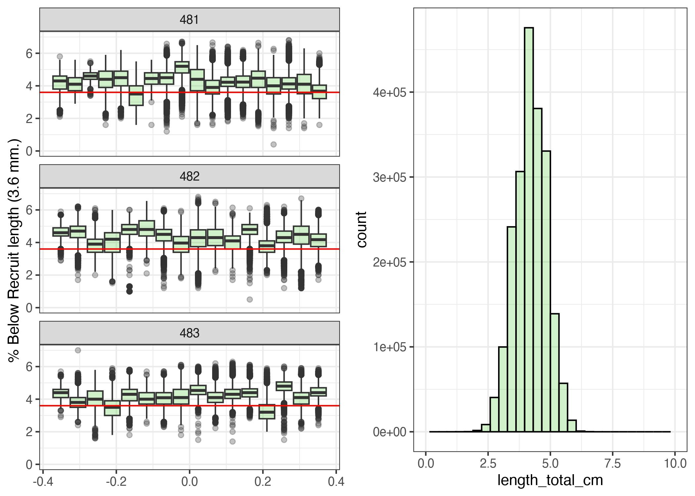
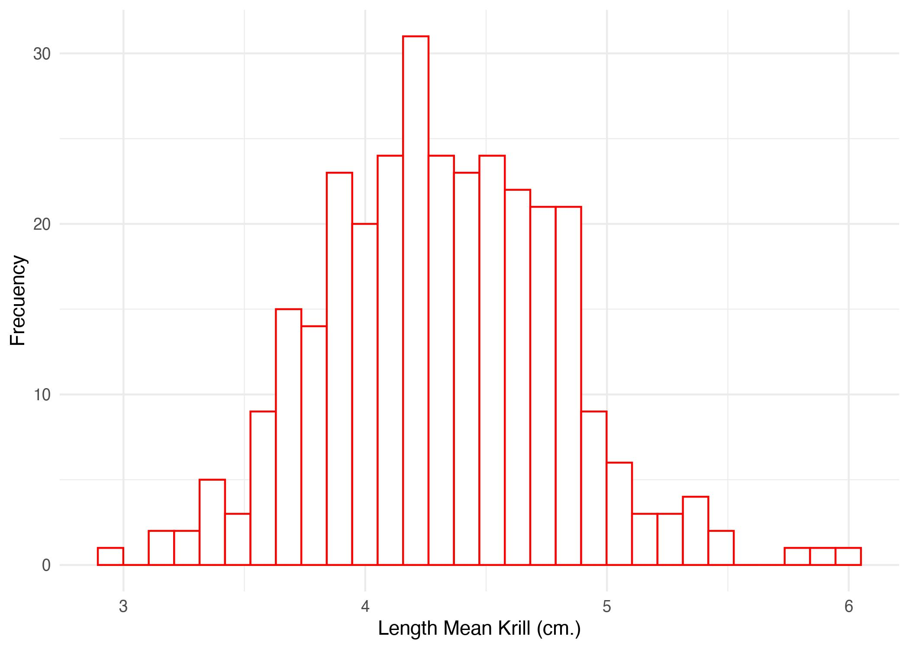

# Context

Testing changes in intrinsic productivity in Antarctic Krill (*Euphausia superba*) with Length-Based Spawning Potential Ratio (LBSPR) [@Hordyk2015a; @Hordyk2016]. 


# Introduction

This package contains functions to run the Length-Based Spawning Potential Ratio (LBSPR) method. The LBSPR package can be used in two ways: 1) simulating the expected length composition, growth curve, and SPR and yield curves using the LBSPR model and 2) fitting to empirical length data to provide an estimate of the spawning potential ratio (SPR).

The LBSPR method has been developed for data-limited fisheries, where few data are available other than a representative sample of the size structure of the vulnerable portion of the population (i.e., the catch) and an understanding of the life history of the species. The LBSPR method does not require knowledge of the natural mortality rate (M), but instead uses the ratio of natural mortality and the von Bertalanffy growth coefficient (K) (M/K), which is believed to vary less across stocks and species than Natural Mortality [@Prince2018].

Like any assessment method, the LBSPR model relies on a number of simplifying assumptions. In particular, the LBSPR models are equilibrium based, and assume that the length composition data is representative of the exploited population at steady state. See the publicaitons listed in the reference list for full details of the assumptions of the model, including simulation testing to evauate the effect of violations of these assumptions.

There are two versions of the LBSPR model included in this package.

### Age-Structured Length-Based Model

The LBSPR model described by [@Hordyk2015a; @Hordyk2016], and tested in a MSE framework [@Hordyk2015a], use a conventional age-structured equilibrium population model. An important assumption of this model structure is that selectivity is age-based not length-based.

### Length-Structured Growth-Type-Group Model

@Hordyk2016 describe a length-structured version of the LBSPR model that uses growth-type-groups (GTG) to account for size-based selectivity. The GTG-LBSPR model also has the ability to include variable M at size (by default M is assumed to be constant). The GTG-LBSPR model typically estimates a lower fishing mortality rate for a given size structure compared to the earlier age-structured model. This is because the age-structured model has a 'regeneration assumption', where, because of the age-based selectivity assumption, large individuals are expected even at high fishing mortality (large, young fish).

The default setting for the LBSPR package is to use the GTG-LBSPR model for all simulation and estimation. Control options in the simulation and estimation functions can be used to switch to the age-structured LBSPR model.


# First Steps

### 2.1 Installing the Package
The LBSPR package is now available on CRAN:


```r
rm(list = ls())
knitr::opts_chunk$set(echo = TRUE,
                      message = FALSE,
                      warning = FALSE,
                      fig.align = 'center',
                      dev = 'jpeg',
                      dpi = 300)
#XQuartz is a mess, put this in your onload to default to cairo instead
options(bitmapType = "cairo") 
# (https://github.com/tidyverse/ggplot2/issues/2655)
# Lo mapas se hacen mas rapido
```


```r
#install.packages("LBSPR")
#install.packages("devtools")
#devtools::install_github("AdrianHordyk/LBSPR")
###load the package
library(LBSPR)
library(devtools)#to install_github
library(dplyr)
library(tidyr)
library(ggplot2)
library(stringr)
```

# Simulation

The LBSPR package can be used to generate the expected size composition, the SPR, and relative yield for a given set of biological and exploitation pattern parameters.

## LB_pars Object
The first thing to do is to create a LB_pars object that contains all of the required parameters for the simulation model. LB_pars is an S4 class object.

#### Create a new LB_pars Object
To create a new LB_pars object you use the new function:


```r
MyPars <- new("LB_pars")
```

You can see the elements or slots of the LB_pars object using the slotNames function:


```r
slotNames(MyPars)
```

```
##  [1] "Species"      "MK"           "M"            "Linf"         "L_units"     
##  [6] "CVLinf"       "L50"          "L95"          "Walpha"       "Walpha_units"
## [11] "Wbeta"        "FecB"         "Steepness"    "Mpow"         "R0"          
## [16] "SL50"         "SL95"         "MLL"          "sdLegal"      "fDisc"       
## [21] "FM"           "SPR"          "BinMin"       "BinMax"       "BinWidth"
```
MyPars is an object of class LB_pars. You can access the help file for classes by using the ? symbol (similar to how you find the help file for functions):


```r
#class?LB_pars
```


####  Populate the LB_pars Object
The LB_pars object has 25 slots. However, not all parameters need to be specified for the simulation model.

Some parameters are essential, and a warning message should appear if you attempt to progress without values (please let me know if there are issues).

Default values will be used for some of the other parameters if no value is specified. For example, the first slot (Species) is a character object that can be used for the species name. If this slot is left empty, the simulation model will populate it with a default value.

A message should alert you any time a default value is being used. The minimum parameters that are needed for the simulation model are:

Biology

von Bertalanffy asymptotic length (Linf)
M/K ratio (natural mortality divided by von Bertalanffy K coefficient) (MK)
Length at 50% maturity (L50)
Length at 95% maturity (L95)
Exploitation - Length at 50% selectivity (SL50) - Length at 95% selectivity (SL95) - F/M ratio (FM) or SPR (SPR). If you specify both, the F/M value will be ignored.

Size Classes - Width of the length classes (BinWidth)

Remember, you can find the help documentation for the LB_pars object by typing: class?LB_pars in the console.

To create an example parameter object:

```r
MyPars@Species <- "Euphausia superba"
MyPars@Linf <- 60 
MyPars@L50 <- 34 
MyPars@L95 <- 55 # verrificar bibliografia
MyPars@MK <- 0.4/0.45


#Explotation
MyPars@SL50 <- 38#numeric() #1
MyPars@SL95 <- 55#numeric() #27
MyPars@SPR <- 0.75 #numeric()# ###cambia el numero 0.4 a en blanco
MyPars@BinWidth <- 1
#MyPars@FM <- 1

MyPars@Walpha <- 0.005
MyPars@Wbeta <- 3.0637 #r2 = 0.9651
```
BinMax not set. Using default of 1.3 Linf
BinMin not set. Using default value of 0
You will notice some messages in the console alerting you that default values have been used. You can change these by specifying values in MyPars and re-running the LBSPRsim function.

We'll manually set those values here so we don't keep seeing the messages throughout the vignette

```r
MyPars@BinWidth <-1
MyPars@BinMax <- 70
MyPars@BinMin <- 0
MyPars@L_units <- "mm"
```
We can also choose to set the units for the length parameters:

MyPars@L_units <- "mm"

### 3.2 Running the Simulation Model
Now we are ready to run the LBSPR simulation model. To do this we use the LBSPRsim function:
ngtg function es el # de grupos para el GTG model, por default es 13)

```r
MySim <- LBSPRsim(MyPars, Control=list(modtype="GTG", maxFM=5)) 
```


#### 3.2.1 The LB_obj Object
The output of the LBSPRsim function is an object of class LB_obj. This is another S4 object, and contains all of the information from the LB_pars object and the output of the LBSPRsim function.

Many of the functions in the LBSPR package return an object of class LB_obj. You should not modify the LB_obj object directly. Rather, make changes to the LB_pars object (MyPars in this case), and re-run the simulation model (or other functions, covered later in the vignette).

#### 3.2.2 Simulation Output
Let's take a look at some of the simulated output.

```r
MySim@SPR 
```

```
## [1] 0.75
```

The simulated SPR is the same as our input value (MyPars@SPR).

What is the ratio of fishing mortality to natural mortality in this scenario?

```r
MySim@FM 
```

```
## [1] 0.27
```

It is important to note that the F/M ratio reported in the LBSPR model refers to the apical F over the adult natural mortality rate. That is, the value for fishing mortality refers to the highest level of F experienced by any single size class.

If the selectivity pattern excludes all but the largest individuals from being exploited, it is possible to have a very high F/M ratio in a sustainable fishery (high SPR). And visceverse!!


#### 3.2.3 Control Options
There are a number of additional parameters that can be modified to control other aspects of the simulation model.

For example, by default the LBSPR model using the Growth-Type-Group model (Hordyk et at. 2016). The Control argument can be used to switch to the Age-Structured model (Hordyk et al. 2015a, b):

See the help file for the LBSPRsim function for additional parameters for the Control argument.

#### 3.2.4 Plotting the Simulation
The plotSim function can be used to plot MySim:
<div class="figure" style="text-align: center">

<p class="caption">Ploteo de Simulaci?n estructuras.</p>
</div>

By default the function plots: a) the expected (equilibrium) size structure of the catch and the expected unfished size structure of the vulnerable population, b) the maturity and selectivity-at-length curves, c) the von Bertalanffy growth curve with relative age, and d) the SPR and relative yield curves as a function of relative fishing mortality (see note above on the F/M ratio).

The plotSim function can be controlled in a number of ways. For example, you can plot the expected unfished and fished size structure of the population by changing the lf.type argument:
<div class="figure" style="text-align: center">

<p class="caption">Ploteo de Simulaci?n Population.</p>
</div>

Individual plots can be created using the type argument:
<div class="figure" style="text-align: center">

<p class="caption">Plot Leng Freq</p>
</div>

See ?plotSim for more options for plotting the output of the LBSPR simulation model.

\newpage

# 4 Fitting Empirical Length Data
Two objects are required to fit the LBSPR model to length data: LB_pars which contains the life-history parameters (described above) and LB_lengths, which contains the length frequency data.

### 4.1 Creating a LB_lengths object
A LB_lengths object can be created in two ways. The new function can be used to create an empty object which can be manually populated:

```r
MyLengths <- new("LB_lengths")
```


```r
slotNames(MyLengths)
```

```
## [1] "LMids"   "LData"   "L_units" "Years"   "NYears"  "Elog"
```


However, it is probably easier to create the LB_lengths object by directly reading in a CSV file.

Now, we need set our directory

```r
datdir <- setwd("~/DOCAS/LBSPR_Krill")  
```

#### 4.2 Reading in Example CSV
A valid LB_pars object must be first created (see sections above):


```r
MyPars <- new("LB_pars")
## A blank LB_pars object created
## Default values have been set for some parameters
MyPars@Species <- "Euphausia superba"
MyPars@Linf <- 60 
MyPars@L50 <- 34 
MyPars@L95 <- 55 # verrificar bibliografia
MyPars@MK <- 0.4/0.45


#Explotation
MyPars@SL50 <- 38#numeric() #1
MyPars@SL95 <- 55#numeric() #27
MyPars@SPR <- 0.25 #numeric()# ###cambia el numero 0.4 a en blanco
MyPars@BinWidth <- 1
#MyPars@FM <- 1

MyPars@Walpha <- 0.005
MyPars@Wbeta <- 3.0637 #r2 = 0.9651
MyPars@BinWidth <-1
MyPars@BinMax <- 70
MyPars@BinMin <- 0
MyPars@L_units <- "mm"
```

Note that only the life history parameters need to be specified for the estimation model. The exploitation parameters will be estimated.

A length frequency data set with multiple years:

```r
Len1 <- new("LB_lengths", LB_pars=MyPars, file=paste0(datdir, "/Length_481_Krill.csv"), dataType="freq",sep=";",header=T)
```

Another form to read data is: 
A length frequency data set with multiple years and a header row (identical to Len1 data, but with a header row):

Len2 <- new("LB_lengths", LB_pars=MyPars, file=paste0(datdir, "/LFreq_MultiYrHead.csv"), 
            dataType="freq", header=TRUE)
A raw length data set with multiple years:

Len3 <- new("LB_lengths", LB_pars=MyPars, file=paste0(datdir, "/LRaw_MultiYr.csv"), 
            dataType="raw")
Length bin parameters (BinMax) must be set for raw data. Using defaults
Length bin parameters (BinMin) must be set for raw data. Using defaults
Length bin parameters (BinWidth) must be set for raw data. Using defaults
Notice that for raw length measurements you must specify the parameters for the length bins (maximum, minimum, and width of length classes) in the LB_pars object. If these are left blank, default values are used.

## 4.3 Plotting Length Data
The plotSize function can be used to plot the imported length data. This is usually a good idea to do before proceeding with fitting the model, to confirm that everything has been read in correctly:

```r
plotSize(Len1)
```



### 4.4 Fit the Model
The LBSPR model is fitted using the LBSPRfit function:


```r
myFit1 <- LBSPRfit(MyPars, Len1)
```

to fit another data,
myFit2 <- LBSPRfit(MyPars, Len2)
Note that the Control argument can be used to modify the additional parameters or LBSPR model type (see description in earlier section).

### 4.5 Examine and Plot Results
The LBSPR package uses a Kalman filter and the Rauch-Tung-Striebel smoother function (see FilterSmooth) to smooth out the multi-year estimates of SPR, F/M, and selectivity parameters.

The smoother parameter estimates can be accessed from the myFit object (which is an object of class LB_obj [see earlier section for details]):


```r
myFit1@Ests
```

```
##        SL50  SL95   FM  SPR
##  [1,] 43.83 54.14 6.17 0.24
##  [2,] 43.07 53.00 5.69 0.24
##  [3,] 42.86 52.62 5.33 0.24
##  [4,] 42.93 53.48 5.20 0.24
##  [5,] 42.51 53.38 4.97 0.24
##  [6,] 41.64 52.37 4.81 0.24
##  [7,] 42.09 52.74 4.79 0.24
##  [8,] 42.53 53.32 4.78 0.25
##  [9,] 42.76 53.70 4.69 0.26
## [10,] 41.67 52.60 4.37 0.25
## [11,] 40.47 50.64 4.25 0.23
## [12,] 40.08 50.04 4.27 0.22
## [13,] 39.71 49.73 4.20 0.22
## [14,] 39.24 49.32 4.08 0.21
## [15,] 38.19 47.98 3.91 0.20
## [16,] 37.70 47.48 3.91 0.20
## [17,] 37.17 47.05 3.86 0.19
## [18,] 36.82 46.65 3.99 0.18
```


Note that by default the smoothed estimates are used in the plotting routines.

The individual point estimates for each year can be accessed from the LB_obj object:


```r
data.frame(rawSL50=myFit1@SL50, rawSL95=myFit1@SL95, rawFM=myFit1@FM, rawSPR=myFit1@SPR)
```

```
##    rawSL50 rawSL95 rawFM     rawSPR
## 1    51.80   66.05 11.00 0.27075727
## 2    37.66   45.39  4.58 0.16112290
## 3    40.11   40.28  2.92 0.28958137
## 4    47.76   63.13  6.28 0.25007834
## 5    46.96   62.34  4.30 0.29298975
## 6    28.48   38.74  3.29 0.09639728
## 7    42.25   50.53  4.82 0.23245955
## 8    44.49   55.33  5.43 0.24490900
## 9    56.08   68.49  7.11 0.47756227
## 10   42.73   61.18  2.34 0.31364754
## 11   32.46   37.09  2.85 0.15464924
## 12   39.78   47.09  5.14 0.18430564
## 13   40.71   50.75  4.72 0.19728857
## 14   45.03   58.66  4.53 0.26009592
## 15   32.59   39.55  2.33 0.18657642
## 16   38.19   46.76  4.29 0.17394007
## 17   35.24   46.71  2.11 0.23599986
## 18   33.39   42.69  5.29 0.09232830
```


The plotSize function can also be used to show the model fit to the data:


Similarly, the plotMat function can be used to show the specified maturity-at-length curve, and the estimated selectivity-at-length curve:


Finally, the plotEsts function can be used to visually display the estimated parameters. Note that this works for all data sets, but only makes sense when there are several years of data:


By default the plotting function adds the smoother line to the estimated points.


# 5 Comparing Observed Length Data to Target Size Structure
You can compare the observed size data against an expected size composition at a target SPR using the plotTarg function. To do this, you need a LB_pars object with the life history parameters and the target SPR:


```r
Mod <- LBSPRfit(MyPars, Len1, verbose=FALSE)

yr <- 1 # first year of data
MyPars@SL50 <- Mod@SL50[yr]
MyPars@SL95 <- Mod@SL95[yr] 
```


# 6 References


