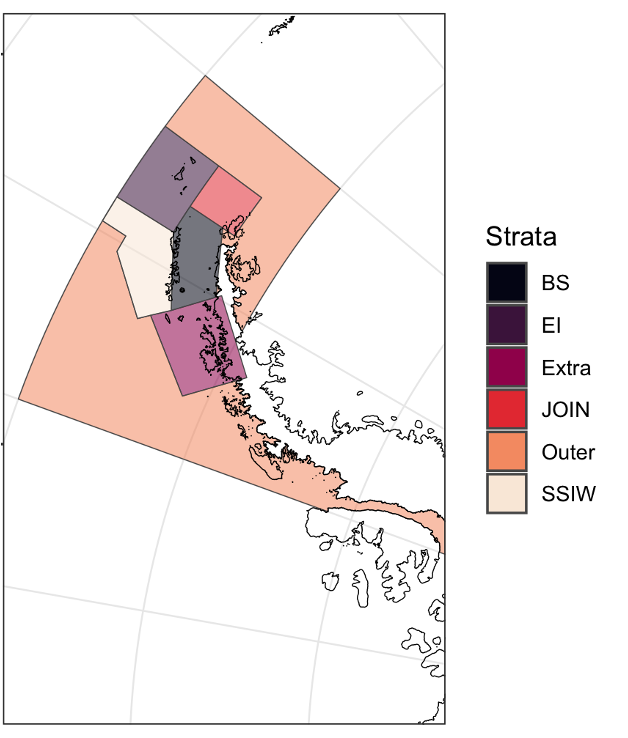
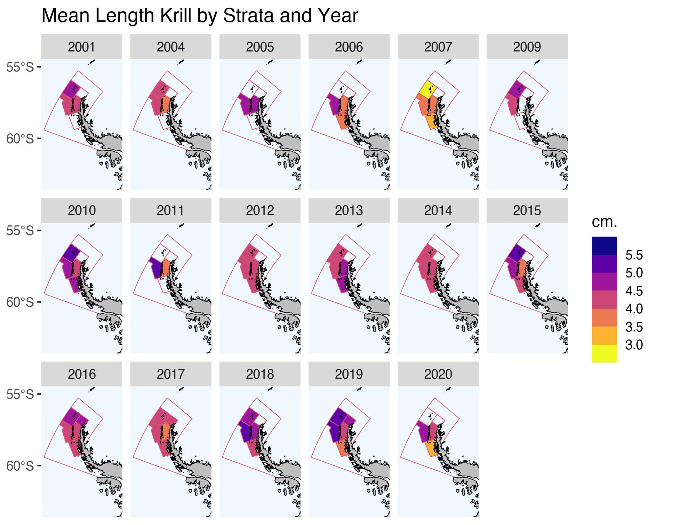
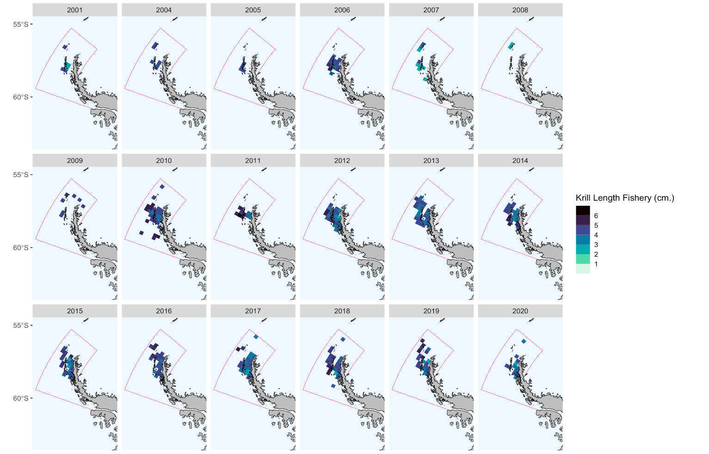

```{=tex}
\fontsize{12}{14}
\selectfont{}
```
\newpage

```{=latex}
\setcounter{tocdepth}{3}
\tableofcontents
```
\newpage

# ABSTRACT

Testing changes spatial and temporal in intrinsic productivity in Antarctic Krill (*Euphausia superba*) with Length-Based Spawning Potential Ratio (LBSPR).


One way to understand krill dynamics is through empirical data such as sizes structure from the fishery. In this sense we can, through the life history parameters and the sizes through the years, what should be the virgin reproductive potential (intrinsic productivity) and under the effects of fishing.


Recognizing the intrinsic productivity changes of krill based on their reproductive potential and how this changes in time and space, serves to recognize the particularities of this species and the implications that these results may have for management in the CCAMLR context.


*Keywords: Lenght Structure, Intrinsic productivity, SPR, Krill, 48.1 SubArea*

\newpage

# 1. INTRODUCTION

The northern Antarctic Peninsula ecosystem is a critical
region of the Southern Ocean for populations of Antarctic
krill (*Euphausia superba*; hereafter krill) serving as a major
spawning and recruitment area and as an overwintering hotspot, especially within Bransfield Strait. Over the last 40 years, climate driven
changes have resulted in warming waters, declines in seasonal sea ice extent and duration [@Stammerjohn2008a; @Stammerjohn2008], changing trends phytoplankton productivity.

Additionally, changes have impacted the population dynamics of krill, resulting in the contraction of the population in the southwest Atlantic Ocean toward the
peninsula and increasing the mean length of krill, suggesting
that recruitment events are declining [@Atkinson2009]. These changes in the population structure have been verified in this resource for the last years [@Reiss2020]. This has implications for the reproductive potential of the species and this, in turn, for productivity.

One way to understand and measure changes in intrinsic productivity is through assessing the ratio of krill reproductive potential. There are many length-based assessment methods to understand this changes between years [@Rudd2017a; @Froese2018; @Hordyk2016; @Canales2021]. On the other hand, one of the advantages of these methods is to use one of the most reliable and abundant sources in the sampling of fishing activities, such as size structures [@Canales2021].  

In this sense, we propose an analysis to understand the intrinsic productivity trhought Spawning Pontential Ratio (SPR) from krill population catch in SubArea 48.1 in Antarctic Peninsula in Southern Ocean.

\newpage

# 2. METHODOLOGY

## 2.1. Study area

One important thing in this analysis is considering spatial structure in 48.1. For this we can follow Strata structure like show in this figure


<center>

{width=50%}

</center>


This consideration is because we have different size structure in each strata, like we can see in this figure.



With this differences, we proceed to search intrinsic productivity (Spawning Potential Ratio) by strata and by years.

The LBSPR method has been developed for data-limited fisheries, where
few data are available other than a representative sample of the size
structure of the vulnerable portion of the population (i.e., the catch)
and an understanding of the life history of the species. The LBSPR
method does not require knowledge of the natural mortality rate (M), but
instead uses the ratio of natural mortality and the von Bertalanffy
growth coefficient (K) (M/K), which is believed to vary less across
stocks and species than Natural Mortality [@Prince2018].

Like any assessment method, the LBSPR model relies on a number of
simplifying assumptions. In particular, the LBSPR models are equilibrium
based, and assume that the length composition data is representative of
the exploited population at steady state. See the publicaitons listed in
the reference list for full details of the assumptions of the model,
including simulation testing to evauate the effect of violations of
these assumptions.

There are two versions of the LBSPR model included in this package.

## 2.1. Age-Structured Length-Based Model

The LBSPR model described by [@Hordyk2014c; @Hordyk2016], and tested in
a MSE framework [@Hordyk2014c], use a conventional age-structured
equilibrium population model. An important assumption of this model
structure is that selectivity is age-based not length-based.

## 2.2. Length-Structured Growth-Type-Group Model

@Hordyk2016 describe a length-structured version of the LBSPR model that
uses growth-type-groups (GTG) to account for size-based selectivity. The
GTG-LBSPR model also has the ability to include variable M at size (by
default M is assumed to be constant). The GTG-LBSPR model typically
estimates a lower fishing mortality rate for a given size structure
compared to the earlier age-structured model. This is because the
age-structured model has a 'regeneration assumption', where, because of
the age-based selectivity assumption, large individuals are expected
even at high fishing mortality (large, young fish).

The default setting for the LBSPR package is to use the GTG-LBSPR model
for all simulation and estimation. Control options in the simulation and
estimation functions can be used to switch to the age-structured LBSPR
model.


The krill population structure changes over time and space. Trying to understand these cycles is part of the assessment and management process for the population in the context of CCAMLR. (Figure 1).


Focus on 48.1 SuArea (Figure 1).


LB-SPR uses length-composition data and as- sumptions about biological parameters to make a rapid assess- ment of stock status relative to unfished levels assuming equilibrium conditions (Hordyk et al. 2015; Prince et al. 2015b). While LB-SPR can use multiple years of length data, status deter- mination is based on one year of data at a time (i.e., estimates of status over multiple years are based on that year’s length compo- sition alone). Mean-length mortality estimators (e.g., Gedamke and Hoenig 2006), first developed by Beverton and Holt (1957), assume that fishing mortality directly influences mean length of the catch and have been used for assessments in the US South Atlantic, Pacific islands, and Caribbean (Ehrhardt and Ault 1992; Ault et al. 2005, 2008; Gedamke and Hoenig 2006; Nadon et al. 2015). As measures of stock status, these length-based methods derive the spawning potential ratio (SPR) reference point, defined as the proportion of unfished reproductive potential at a given level of fishing pressure (Goodyear 1993).

## 2.3. Installing the Package

The LBSPR package is now available on CRAN:

```{r setup1}
rm(list = ls())
knitr::opts_chunk$set(echo = TRUE,
                      message = FALSE,
                      warning = FALSE,
                      fig.align = 'center',
                      dev = 'jpeg',
                      dpi = 300,
                      fig.width = 6)
#XQuartz is a mess, put this in your onload to default to cairo instead
options(bitmapType = "cairo") 
# (https://github.com/tidyverse/ggplot2/issues/2655)
# Lo mapas se hacen mas rapido
```

```{r}
#install.packages("LBSPR")
#install.packages("devtools")
#devtools::install_github("AdrianHordyk/LBSPR")
###load the package
library(LBSPR)
library(devtools)#to install_github
library(dplyr)
library(tidyr)
library(ggplot2)
library(stringr)
```
\newpage

## 2.4. Simulation

The LBSPR package can be used to generate the expected size composition,
the SPR, and relative yield for a given set of biological and
exploitation pattern parameters.

## 2.5. LB_pars Object to Antarctic Krill

The first thing to do is to create a LB_pars object that contains all of
the required parameters for the simulation model. LB_pars is an S4 class
object.

#### 2.5.1. Create a new LB_pars Object

To create a new LB_pars object you use the new function:

```{r}
MyPars <- new("LB_pars")
```

You can see the elements or slots of the LB_pars object using the
slotNames function:

```{r}
slotNames(MyPars)
```

MyPars is an object of class LB_pars. You can access the help file for
classes by using the ? symbol (similar to how you find the help file for
functions):

```{r echo =TRUE}
#class?LB_pars
```

#### 2.5.2. Populate the LB_pars Object with Krill parameters

The LB_pars object has 25 slots. However, not all parameters need to be
specified for the simulation model.

Some parameters are essential, and a warning message should appear if
you attempt to progress without values (please let me know if there are
issues).

Default values will be used for some of the other parameters if no value
is specified. For example, the first slot (Species) is a character
object that can be used for the species name. If this slot is left
empty, the simulation model will populate it with a default value.

A message should alert you any time a default value is being used. The
minimum parameters that are needed for the simulation model are:

Biology

- von Bertalanffy asymptotic length `Linf` 
- M/K ratio (natural mortality)divided by von Bertalanffy K coefficient) `MK` 
- Length at 50% maturity (`L50`) 
- Length at 95% maturity (`L95`) 

Exploitation 

- Length at 50% selectivity (`SL50`) 
- Length at 95% selectivity (`SL95`) 
- Biological Reference Point (BRP). 
F/M ratio (`FM`) or Spawning Potential Ratio (`SPR`). If you specify both, the F/M value will be ignored.

Size Classes 

-Width of the length classes (`BinWidth`)

Remember, you can find the help documentation for the LB_pars object by
typing: `class?LB_pars` in the console.

To create an example parameter object regarding @Maschette2020;

Creating parms template

```{r}
MyPars <- new("LB_pars")
## A blank LB_pars object created
## Default values have been set for some parameters
MyPars@Species <- "Euphausia superba"
MyPars@Linf <- 60 
MyPars@L50 <- 34 
MyPars@L95 <- 55 # verrificar bibliografia
MyPars@MK <- 0.4/0.45


#Explotation
MyPars@SL50 <- 40#numeric() #1
MyPars@SL95 <- 56#numeric() #27
MyPars@SPR <- 0.75 #numeric()# ###cambia el numero 0.4 a en blanco
MyPars@BinWidth <- 1
#MyPars@FM <- 1

MyPars@Walpha <- 1
MyPars@Wbeta <- 3.0637 #r2 = 0.9651

MyPars@BinWidth <-1
MyPars@BinMax <- 70
MyPars@BinMin <- 0
MyPars@L_units <- "mm"
```

BinMax not set. Using default of 1.3 Linf BinMin not set. Using default
value of 0 You will notice some messages in the console alerting you
that default values have been used. You can change these by specifying
values in MyPars and re-running the LBSPRsim function.

We'll manually set those values here so we don't keep seeing the
messages throughout the vignette. We can also choose to set the units for the length parameters by `L_units`


## 2.6. Running the Simulation Model

Now we are ready to run the LBSPR simulation model. To do this we use
the LBSPRsim function: ngtg function es el \# de grupos para el GTG
model, por default es 13)

```{r, echo =TRUE}
MySim <- LBSPRsim(MyPars, 
                  Control=list(modtype="GTG", 
                               maxFM=1)) 
```

#### 2.6.1. The LB_obj Object

The output of the LBSPRsim function is an object of class LB_obj. This
is another S4 object, and contains all of the information from the
LB_pars object and the output of the LBSPRsim function.

Many of the functions in the LBSPR package return an object of class
LB_obj. You should not modify the LB_obj object directly. Rather, make
changes to the LB_pars object (MyPars in this case), and re-run the
simulation model (or other functions, covered later in the vignette).

#### 2.6.2. Simulation Output

Let's take a look at some of the simulated output.

```{r, echo =TRUE}
MySim@SPR 
```

The simulated SPR is the same as our input value
`MyPars@SPR`

What is the ratio of fishing mortality to natural mortality in this
scenario?

```{r}
MySim@FM 
```

It is important to note that the F/M ratio reported in the LBSPR model
refers to the apical F over the adult natural mortality rate. That is,
the value for fishing mortality refers to the highest level of F
experienced by any single size class.

If the selectivity pattern excludes all but the largest individuals from
being exploited, it is possible to have a very high F/M ratio in a
sustainable fishery (high SPR). And visceverse!!

#### 2.6.3. Control Options

There are a number of additional parameters that can be modified to
control other aspects of the simulation model.

For example, by default the LBSPR model using the Growth-Type-Group
model (Hordyk et at. 2016). The Control argument can be used to switch
to the Age-Structured model (Hordyk et al. 2015a, b):

See the help file for the LBSPRsim function for additional parameters
for the Control argument.

#### 2.6.4. Plotting the Simulation

The plotSim function can be used to plot MySim:

```{r, echo=FALSE, fig.align='center', fig.cap="Ploteo de Simulaci?n estructuras."}
plotSim(MySim) #, type = c("len.freq"))
# plotSim(LB_obj = NULL, type = c("all", "len.freq", "growth",
#   "maturity.select", "yield.curve"), lf.type = c("catch", "pop"),
#   growth.type = c("LAA", "WAA"), y.type = c("SPR", "SSB", "Yield", "YPR"),
#   x.type = c("FM", "SSB", "SPR"), perRec = FALSE, inc.SPR = TRUE,
#   Cols = NULL, size.axtex = 12, size.title = 14, size.SPR = 4,
#   size.leg = 12, inc.pts = TRUE, size.pt = 4)
```

By default the function plots: a) the expected (equilibrium) size
structure of the catch and the expected unfished size structure of the
vulnerable population, b) the maturity and selectivity-at-length curves,
c) the von Bertalanffy growth curve with relative age, and d) the SPR
and relative yield curves as a function of relative fishing mortality
(see note above on the F/M ratio).

The plotSim function can be controlled in a number of ways. For example,
you can plot the expected unfished and fished size structure of the
population by changing the lf.type argument:

```{r, echo=FALSE,fig.align='center',fig.cap="Ploteo de Simulaci?n Population."}
plotSim(MySim, lf.type="pop")
```

Individual plots can be created using the type argument:

```{r, echo=FALSE,fig.align='center',fig.cap="Plot Leng Freq"}
plotSim(MySim, type="len.freq")
```

See ?plotSim for more options for plotting the output of the LBSPR
simulation model.

\newpage

## 2.7 Fitting Empirical Krill Length Data

Two objects are required to fit the LBSPR model to length data: LB_pars
which contains the life-history parameters (described above) and
LB_lengths, which contains the length frequency data.

#### 2.7.1 Creating a LB_lengths object

A LB_lengths object can be created in two ways. The new function can be
used to create an empty object which can be manually populated:

```{r}
MyLengths <- new("LB_lengths")
```

```{r, echo= TRUE}
slotNames(MyLengths)
```

However, it is probably easier to create the LB_lengths object by
directly reading in a `CSV file`.

Now, we need set our directory again

```{r eho=FALSE}
datdir <- setwd("~/DOCAS/LBSPR_Krill")
```

#### 2.7.2 Reading Krill Data


Note that only the life history parameters need to be specified for the
estimation model. The exploitation parameters will be estimated.

A length frequency data of krill set with multiple years (2001-2020):

```{r, echo =TRUE}
Len1 <- new("LB_lengths", LB_pars=MyPars, file=paste0(datdir, "/Length_481_Krill_2.csv"), dataType="freq",sep=";",header=T)
```

Another form to read data is: A length frequency data set with multiple
years and a header row (identical to Len1 data, but with a header row):


#### 2.7.3 Plotting Length Data Krill

The `plotSize` function can be used to plot the imported length data. This is usually a good idea to do before proceeding with fitting the model, to confirm that everything has been read in correctly:

```{r}
plotSize(Len1)
```

### 2.7.4. Fit the Model

The LBSPR model is fitted using the `LBSPRfit` function:

```{r}
myFit1 <- LBSPRfit(MyPars, Len1)
```

Note that the Control argument can be used to modify the additional parameters or LBSPR model type (see description in earlier section).

# 3. RESULTS

The LBSPR package uses a Kalman filter and the Rauch-Tung-Striebel
smoother function (see FilterSmooth) to smooth out the multi-year
estimates of SPR, F/M, and selectivity parameters.

The smoother parameter estimates can be accessed from the `myFit` object
(which is an object of class LB_obj [see earlier section for details]):

```{r, echo=TRUE}
myFit1@Ests
```

Note that by default the smoothed estimates are used in the plotting
routines.

The individual point estimates for each year can be accessed from the
`LB_obj` object:

```{r, echo = TRUE}
data.frame(rawSL50=myFit1@SL50, rawSL95=myFit1@SL95, rawFM=myFit1@FM, rawSPR=myFit1@SPR)
```

The `plotSize` function can also be used to show the model fit to the
data:

```{r, echo =FALSE}
plotSize(myFit1)
```

Similarly, the plotMat function can be used to show the specified
maturity-at-length curve, and the estimated selectivity-at-length curve:

```{r, echo=FALSE}
plotMat(myFit1,
        useSmooth = TRUE)
```

Finally, the plotEsts function can be used to visually display the
estimated parameters. Note that this works for all data sets, but only
makes sense when there are several years of data:


```{r, echo=FALSE, fig.width=12, fig.height=5}
plotEsts(myFit1,
         pars = c("Sel", "SPR"),
  doSmooth = TRUE,
  incL50 = FALSE,
  CIcol = "blue",
  L50col = "blue")
```

By default the plotting function adds the smoother line to the estimated
points.

\newpage
## 3.1. Comparing Observed Length Data to Target Size Structure

You can compare the observed size data against an expected size
composition at a target SPR using the `plotTarg` function. To do this, you
need a LB_pars object with the life history parameters and the target
SPR:

```{r}
Mod <- LBSPRfit(MyPars, Len1, verbose=FALSE)

yr <- 1 # first year of data
MyPars@SL50 <- Mod@SL50[yr]
MyPars@SL95 <- Mod@SL95[yr] 
```


```{r, echo=FALSE}
plotTarg(MyPars, Len1, yr=yr)
```
\newpage

## 3.3. Reading length strata data

Brainsflied Strata
```{r, echo =TRUE}
Lenbs <- new("LB_lengths", LB_pars=MyPars, file=paste0(datdir, "/Length_481_Krill_2.csv"), dataType="freq",sep=";",header=T)
```

Elephan Island  Strata
```{r, echo =TRUE}
Lenei <- new("LB_lengths", LB_pars=MyPars, file=paste0(datdir, "/lenghtEI.csv"), dataType="freq",sep=";",header=T)
```

Extra Strata
```{r, echo =TRUE}
Lenex <- new("LB_lengths", LB_pars=MyPars, file=paste0(datdir, "/lenghtExtra.csv"), dataType="freq",sep=";",header=T)
```
Join Strata
```{r, echo =TRUE}
Lenjo <- new("LB_lengths", LB_pars=MyPars, file=paste0(datdir, "/lenghtJOIN.csv"), dataType="freq",sep=";",header=T)
```
SSIW Strata
```{r, echo =TRUE}
Lenssiw <- new("LB_lengths", LB_pars=MyPars, file=paste0(datdir, "/lenghtSSIW.csv"), dataType="freq",sep=";",header=T)
```

## 3.4. Fit the Model by strata

The LBSPR model is fitted using the `LBSPRfit` function:

```{r echo=TRUE, message=FALSE}
fitbs <- LBSPRfit(MyPars, Lenbs)
fitei <- LBSPRfit(MyPars, Lenei)
fitex <- LBSPRfit(MyPars, Lenex)
fitjo <- LBSPRfit(MyPars, Lenjo)
fitssiw <- LBSPRfit(MyPars, Lenssiw)

```
The smoother parameter estimates can be accessed from the `myFit` object (which is an object of class LB_obj [see earlier section for details]):
In this cae, we can look up estimates in Brainsfield Strata

```{r, echo=TRUE}
fitei@Ests
```

Plotting fits by strata

Fit Bransfield
```{r}
plotSize(fitbs)
```

Fit Elephan Island
```{r}
plotSize(fitei)
```

Fit Extra
```{r}
plotSize(fitex)
```

Fit Join
```{r}
plotSize(fitjo)
```

Fit SSIW
```{r}
plotSize(fitssiw)
```

Now we use `plotMat` function to know specified
maturity-at-length curve by strata, and the estimated selectivity-at-length curve.

```{r, echo=FALSE}
plotMat(fitbs,
        useSmooth = TRUE,
        Title = "Brainsfield")
```

```{r, echo=FALSE}
plotMat(fitei,
        useSmooth = TRUE,
        Title = "Elephant Island")
```


```{r, echo=FALSE}
plotMat(fitex,
        useSmooth = TRUE,
        Title = "Extra")
```


```{r, echo=FALSE}
plotMat(fitjo,
        useSmooth = TRUE,
        Title = "Join")
```


```{r, echo=FALSE}
plotMat(fitssiw,
        useSmooth = TRUE,
        Title = "SSIW")
```

## 3.5. Comparing producivity between Strata

For this, we extract `SPR` from each slot in the fits models by strata. 

```{r}
sprbs <- as.data.frame(cbind(fitbs@Years, 
                             fitbs@SPR)) 
colnames(sprbs) <- c("Year","SPR")
sprbs$SPRv <- rep("BS", nrow(sprbs))

sprei <- as.data.frame(cbind(fitei@Years, 
                             fitei@SPR)) 
colnames(sprei) <- c("Year","SPR")
sprei$SPRv <- rep("EI", nrow(sprei))

sprex <- as.data.frame(cbind(fitex@Years, 
                             fitex@SPR)) 
colnames(sprex) <- c("Year","SPR")
sprex$SPRv <- rep("EX", nrow(sprex))

sprjo <- as.data.frame(cbind(fitjo@Years, 
                             fitjo@SPR)) 
colnames(sprjo) <- c("Year","SPR")
sprjo$SPRv <- rep("JO", nrow(sprjo))

sprssiw <- as.data.frame(cbind(fitssiw@Years, 
                             fitssiw@SPR)) 
colnames(sprssiw) <- c("Year","SPR")
sprssiw$SPRv <- rep("SSWI", nrow(sprssiw))

allspr <- rbind(sprbs, sprei, sprex, sprjo, sprssiw)

```
Plot with all intrinsic productivity.


```{r warning=FALSE}

allsprpl <- ggplot(allspr,
       aes(Year,
           SPR,
           color=SPRv))+
  geom_point()+
  stat_smooth(method = "lm",
              alpha=0.3)+
  geom_hline(yintercept = 0.75,
               color = "red",
               linetype  = 2,
             alpha=0.5)+
  facet_wrap(.~SPRv, ncol = 3)+
  scale_color_viridis_d(option = "F")+
  scale_y_log10()+
  xlim(2001,2021)+
  theme_bw()+
  theme(legend.position = "none",
        axis.text.x = element_text(angle = 90, hjust = 2))+
  ggtitle(label="Intrinsic Productivity (SPR)")

allsprpl
```

\newpage

# 4. DISCUSSION 

Las cambios espaciales y temporales de la dinámica temporal en el krill se manifiestan de varias maneras, entre ellas, cambios en la distribución, biomasa, fenología entre otras. Sin embargo, la productividad intrínseca poblacional, es decir, el potencial reproductivo tambien ha sufrido cambios por efecto de las  condiciones cambiantes, ya sean ambientales y/o antropogénicas como la pesca.

Aca analizamos mas de 20 años de datos de la pesquería para identificar cambios de la productividad intrinseca en escalas espaciotemporales del krill en la Peninsula Antártica. Estos cambios fueron medidos de forma cuantitativa a través del potencial reproductivo mediante un nobel método de uso común en pesquerías del mundo.


En este método determinamos las diferencias entre estructururas de tallas simuladas del krill en función de sus parámetros de hisoria de vida (@Maschette2020) y las resultantes de la pesquería, lo cua lpermite conocer la diferencia entre el potencial reproductivo virginal y el que actualmente se captura.


Mace & Sissenwine (1993) Review and meta-analysis of SPR reference points for teleosts: 20% SPR as limit reference points, & 35-40% SPR for MSY that have been internationally recognized in the US, USA, Australia, NZ etc. [@Goodyear1993; @Mace2001].


- Preliminar outputs to know intrinsic productivity of Antarctic krill (*Euphausia superba*) in Antarctic Peninsula, SubArea 48.1.

- This method dont incorportate environmental variables

- Based in own krill dynamics

- Do sensitivity analysis based on Linf (5 scenarios)

- This code with methodology in this
[link](https://github.com/MauroMardones/LBSPR_Krill)

\newpage

# 5. REFERENCES
